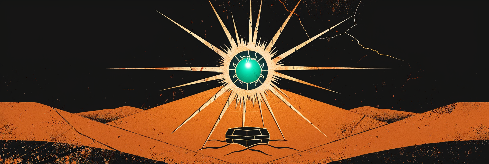
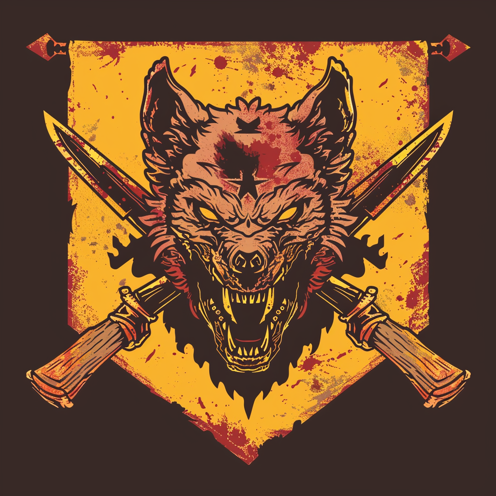
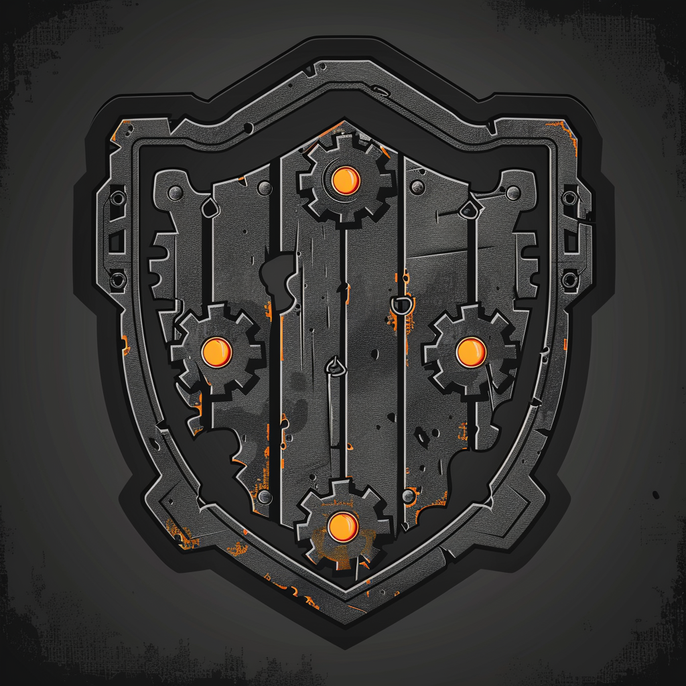
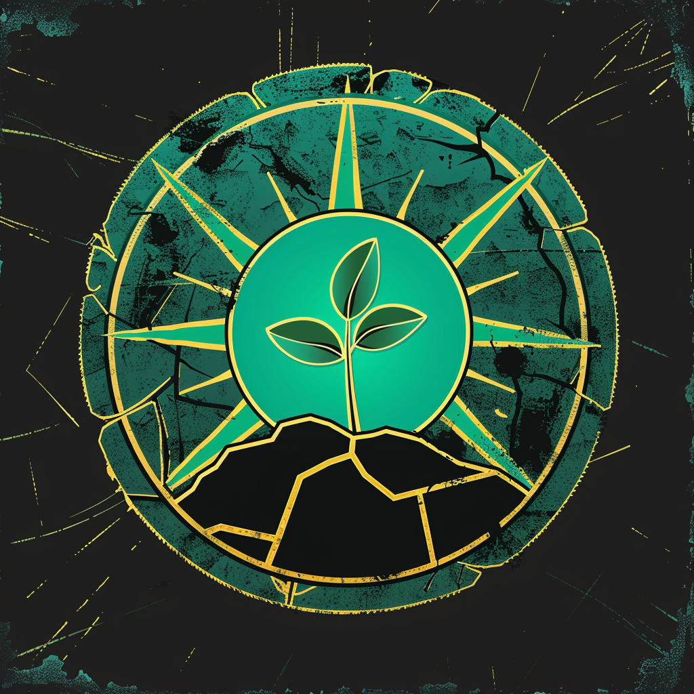

# Arduino Card Game — «Зной»



Цифро-физическая карточная игра в постапокалиптическом пустынном сеттинге **«Зной»**. Механика вдохновлена Hearthstone (пошаговый режим, мана, существа / заклинания / герои), а игровое поле — физическое: на базе **RFID-считывателей** и **RGB-светодиодов** (Arduino / ESP32).

Этот репозиторий — **база знаний по дизайну игры**: сеттинг, фракции, механики, аппаратные конвенции и арт-система. Открывается как Obsidian-vault, но читается и как обычный Markdown.

## Мир

Небо выгорело за один день — этот день зовут **Зноем**. Мир стал бесконечной пустыней; в её центре под дюнами уцелел последний рабочий схрон старого мира — **«Колыбель»**. Кто дойдёт до Колыбели и удержит её — задаст, каким будет следующий мир. Семь фракций выросли вокруг разных обломков старого мира и идут к одному призу.

## Фракции

| Арт | Фракция | Тех-эстетика | Архетип | Главная механика |
|:--:|---|---|---|---|
|  | **Шакалы** | Роевой агро / банды | Агро числом | **Свора** — атака растёт за каждое своё существо |
|  | **Пепел** | Атомпанк | Контроль / взрыв | **Перегрев** — копит атаку и сбрасывает её в урон |
|  | **Химеры** | Генпанк | Качок / value | **Адаптация** — пережив удар, выбирает усиление |
|  | **Бастион** | Дизельпанк | Стена / танк | **Броня** — поглощает урон до здоровья |
|  | **Сеть** | Киберпанк | Темп / помеха | **Взлом** — выключает врага на ход |
|  | **Оазис** | Солярпанк | Лечащий контроль | **Цветение** — лечит всех своих каждый ход |
|  | **Мираж** | Аномалии | Комбо / повтор | **Эхо** — способность срабатывает дважды |

## Навигация по базе знаний

Порядок чтения для старта: **CLAUDE.md → Зной → Обзор фракций**.

- **Правила и ядро механики:** [CLAUDE.md](CLAUDE.md)
- **Сеттинг:** [Зной](docs/setting/znoy.md) · [Палитра тем сеттинга](docs/setting/theme-palette.md)
- **Фракции:** [Обзор + ограничения дизайна + цвета](docs/factions/_overview.md)
- **Карты:** [Каталог карт по фракциям](cards/README.md)
- **Аппаратура:** [Физическое игровое поле](docs/hardware/playfield.md) · [Конвенции LED-индикации](docs/hardware/led-conventions.md)
- **Арт-система:** [Midjourney-промпты](docs/system/art-system.md)
- **Полная карта заметок:** [docs/README.md](docs/README.md)

## Структура репозитория

```
CLAUDE.md          — правила разработки, схема карт, ядро механики, баланс
docs/
  setting/         — лор мира («Зной») и палитра тем сеттинга
  factions/        — описания фракций: механика, примеры, флейвор, цвета
  hardware/        — физическое поле и конвенции LED-индикации
  system/          — арт-система (промпты Midjourney)
  README.md        — навигация по базе знаний (Obsidian MOC)
assets/art/        — PNG-арт фракций и карт
cards/             — карты игры (Markdown), по типам
  README.md        — каталог всех карт по фракциям (MOC)
```

> Грунтованный sci-fi, не фэнтези: всё «странное» — последствия Зноя и аномального поля у Колыбели, а не магия.
