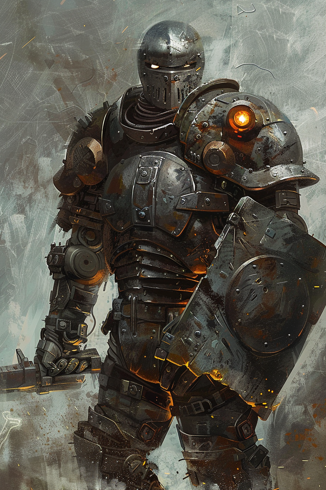
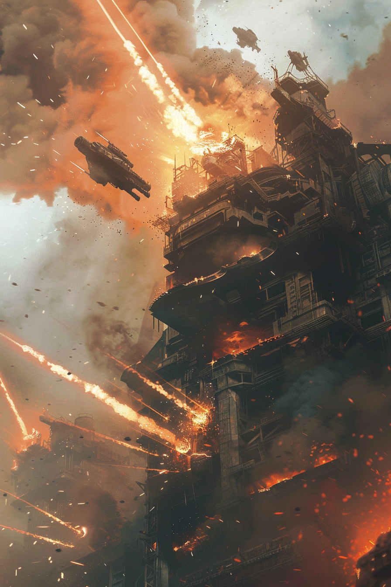
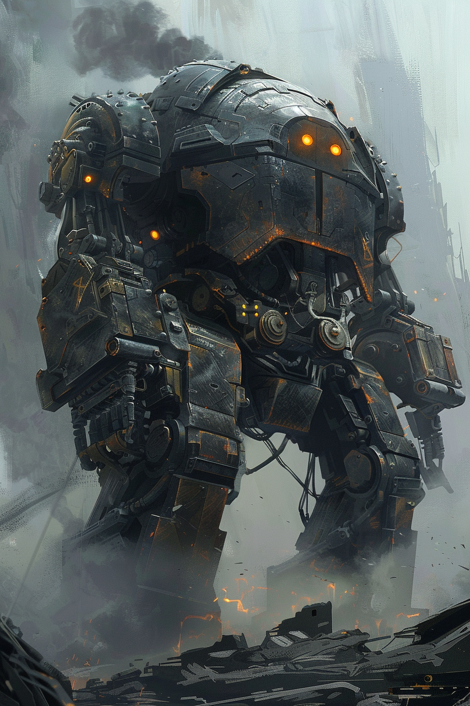
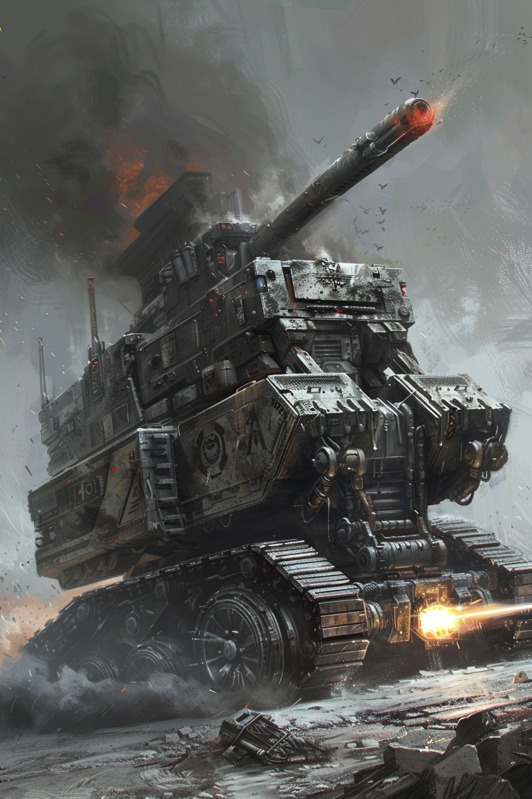
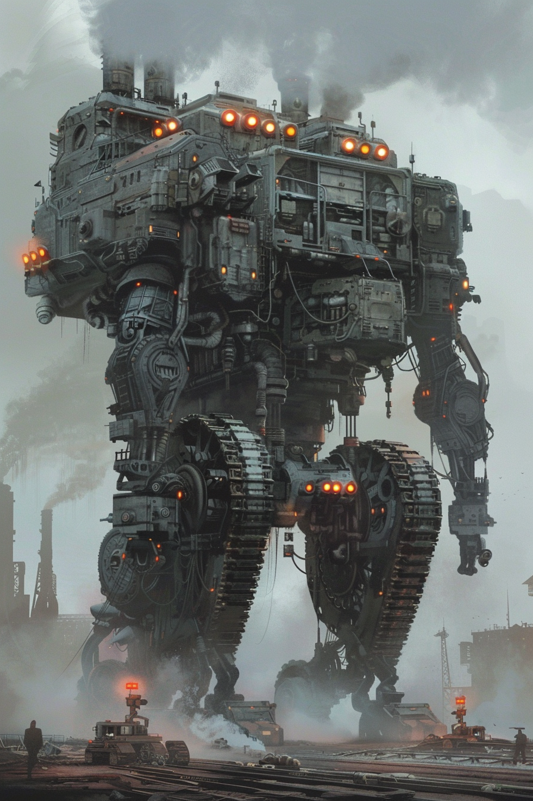

# Карты: Бастион

[🃏 Все карты](../README.md) · [📖 Лор фракции](../../docs/factions/bastion.md) · [🎨 Цвета и обзор](../../docs/factions/_overview.md)

**Броня X** — поглощает урон до здоровья. Архетип: стена / танк. Цвет `#8E8E8E` + `#F39C12`. *(базовая игра)*

| Арт | Карта | Тип | Мана | А/З | Ред. | Способность |
|:--:|---|---|:--:|:--:|:--:|---|
|  | [Прокат, Старшина Литейной](../heroes/bastion-foreman.md) | герой | — | 30 | ★ | **Заклепать:** союзнику `+3` Брони (`≤12`) |
|  | [Клёпаный страж](../minions/bastion-rivet-guard.md) | существо | 2 | 2/3 | common | **Провокация. Броня 1** |
|  | [Картечь](../spells/bastion-grapeshot.md) | заклинание | 2 | — | rare | `1` урон всем вражеским существам *(чистка)* |
|  | [Волнолом](../minions/bastion-bulwark.md) | существо | 4 | 2/5 | rare | **Провокация. Броня 3** |
|  | [Дизельный таран](../minions/bastion-diesel-ram.md) | существо | 6 | 5/3 | epic | **Спешка. Броня 3** |
|  | [Несокрушимый, Стена Бастиона](../minions/bastion-immovable.md) | существо | 8 | 3/8 | ★ | **Провокация. Броня 4.** Начало хода: `+2` Брони |

---

**Другие фракции:** [Шакалы](jackals.md) · [Пепел](ash.md) · [Химеры](chimera.md) · [Сеть](net.md) · [Оазис](oasis.md) · [Мираж](mirage.md)
