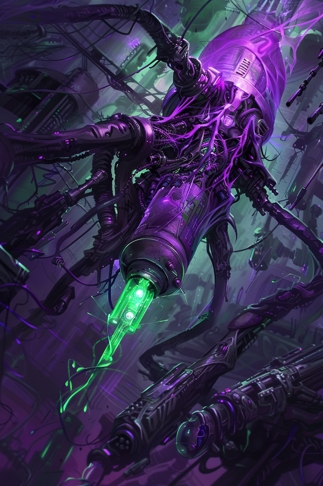
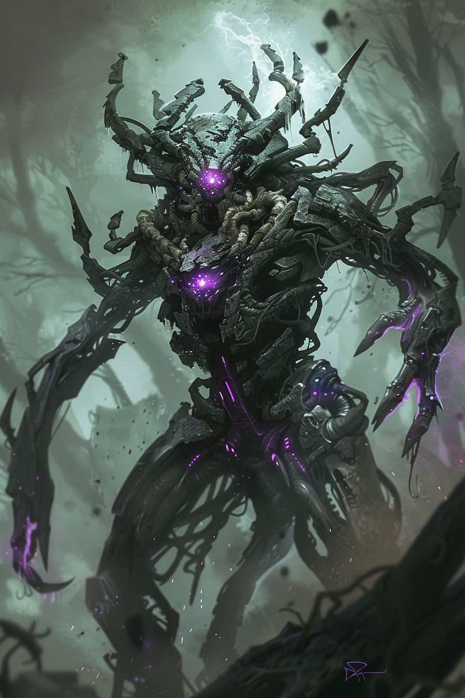

# Карты: Химеры

[🃏 Все карты](../README.md) · [📖 Лор фракции](../../docs/factions/chimera.md) · [🎨 Цвета и обзор](../../docs/factions/_overview.md)

**Адаптация** — пережив первый урон, существо выбирает постоянное усиление. Архетип: качок / value. Цвет  `#B026FF` +  `#39FF14`. *(базовая игра)*

| Арт | Карта | Тип | Мана | А/З | Ред. | Способность |
|:--:|---|---|:--:|:--:|:--:|---|
|  | [Праматерь, Первая из Третьих](../heroes/chimera-progenitor.md) | герой | — | 30 | ★ | **Стимул:** активировать **Адаптацию** союзника без урона |
|  | [Плевок](../minions/chimera-spitling.md) | существо | 2 | 2/3 | common | **Адаптация** (атк / здоровье / Утилизация) |
|  | [Хлестун](../minions/chimera-lasher.md) | существо | 3 | 3/4 | rare | **Адаптация** (атк / здоровье / Досягаемость) |
|  | [Крылатый ужас](../minions/chimera-winged-horror.md) | существо 🜂 | 5 | 3/4 | rare | **Воздушный. Адаптация** (атк / здоровье / Спешка) |
|  | [Мутаген](../spells/chimera-mutagen.md) | заклинание | 2 | — | common | Союзнику `+2/+2` навсегда |
|  | [Апекс, Венец Мутации](../minions/chimera-apex.md) | существо | 7 | 4/6 | ★ | **Адаптация (Венец):** `+2/+2` **и** Провокация сразу |

---

**Другие фракции:** [Шакалы](jackals.md) · [Пепел](ash.md) · [Бастион](bastion.md) · [Сеть](net.md) · [Оазис](oasis.md) · [Мираж](mirage.md)
