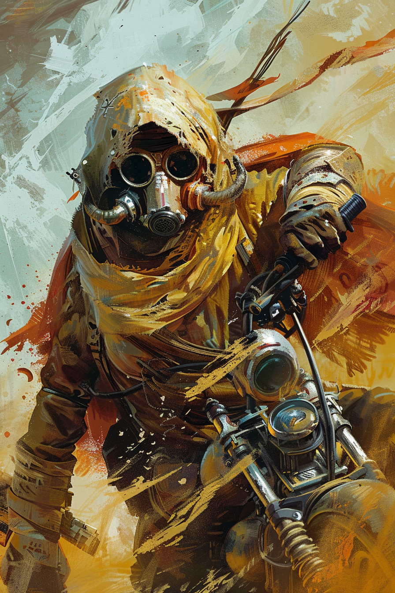
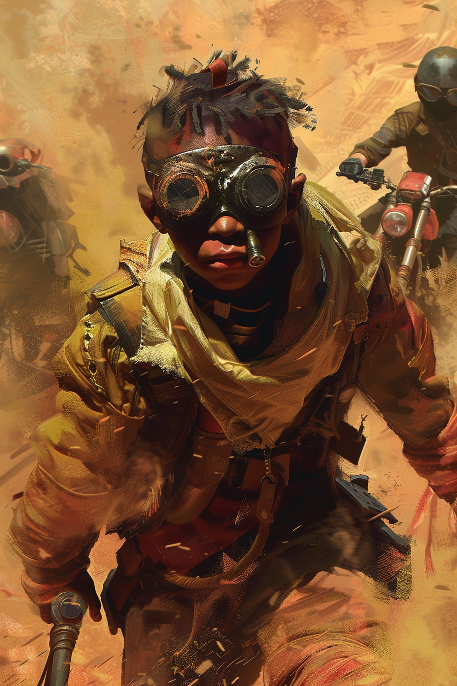

# Карты: Шакалы

[🃏 Все карты](../README.md) · [📖 Лор фракции](../../docs/factions/jackals.md) · [🎨 Цвета и обзор](../../docs/factions/_overview.md)

**Свора X** — атака растёт за каждое другое своё существо. Архетип: агро числом. Цвет `#E8B33A` + `#C0392B`. *(базовая игра)*

| Арт | Карта | Тип | Мана | А/З | Ред. | Способность |
|:--:|---|---|:--:|:--:|:--:|---|
|  | [Рваная, Мать Стаи](../heroes/jackal-matriarch.md) | герой | — | 30 | ★ | **Свистнуть свору:** `2` случайных союзника `+2` атк до конца хода |
|  | [Шакалёнок](../minions/jackal-rat-pup.md) | существо | 1 | 1/2 | common | **Свора 2** |
|  | [Гонщик-налётчик](../minions/jackal-biker-raider.md) | существо | 2 | 2/1 | common | **Спешка. Свора 2** |
|  | [Трубобой](../minions/jackal-pipe-basher.md) | существо | 3 | 3/3 | rare | **Свора 3** |
|  | [Сигнал к налёту](../spells/jackal-raid-call.md) | заклинание | 2 | — | common | Всем союзникам `+1` атк до конца хода |
|  | [Кадавр, Король Свалки](../minions/jackal-junk-king.md) | существо | 7 | 4/4 | ★ | **Спешка. Свора 4.** Клич: другим союзникам `+1` атк |

---

**Другие фракции:** [Пепел](ash.md) · [Химеры](chimera.md) · [Бастион](bastion.md) · [Сеть](net.md) · [Оазис](oasis.md) · [Мираж](mirage.md)
