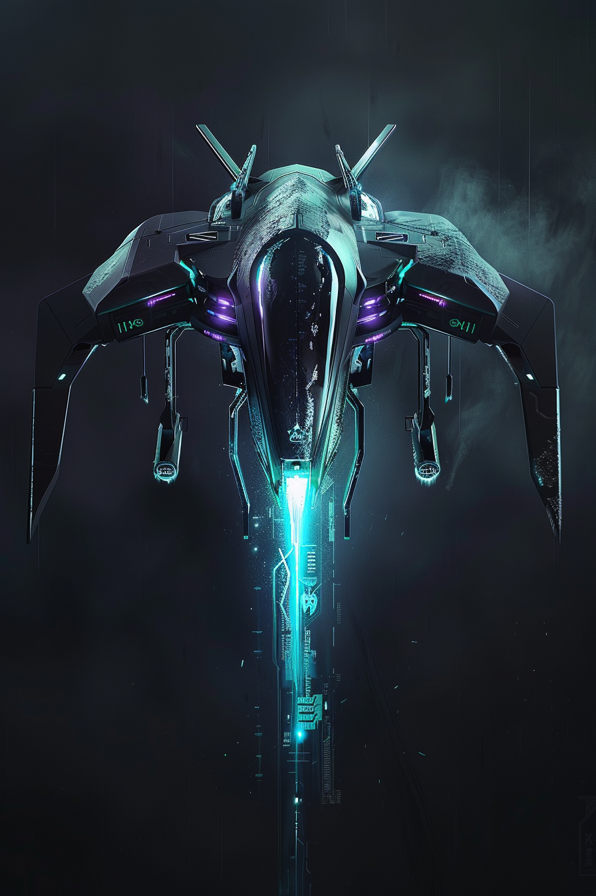
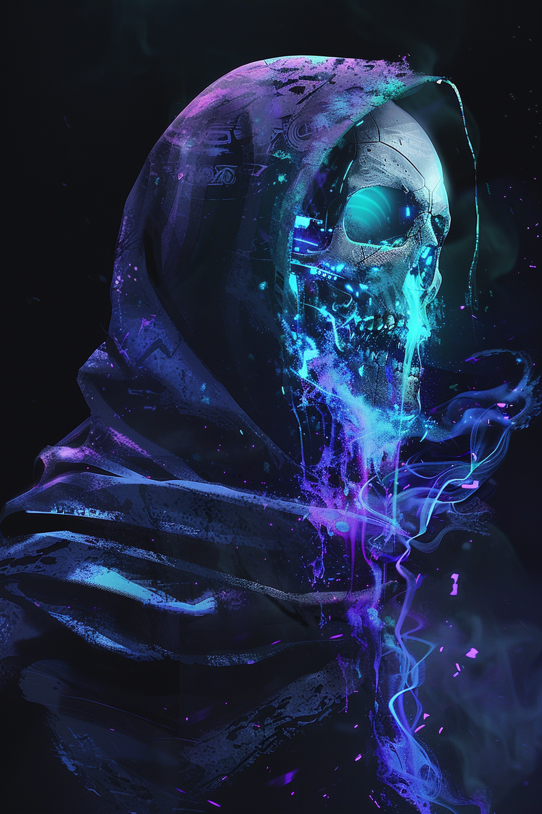

# Карты: Сеть

[🃏 Все карты](../README.md) · [📖 Лор фракции](../../docs/factions/net.md) · [🎨 Цвета и обзор](../../docs/factions/_overview.md)

**Взлом** — выключает вражеское существо на круг. Архетип: темп / помеха. Цвет  `#00E5FF` +  `#7C4DFF`. *(DLC 1)*

| Арт | Карта | Тип | Мана | А/З | Ред. | Способность |
|:--:|---|---|:--:|:--:|:--:|---|
|  | [Рут, Хозяйка Доступа](../heroes/net-root-admin.md) | герой | — | 30 | ★ | **Глушилка:** Заглушить врага до вашего след. хода |
|  | [Скриптарь](../minions/net-script-kiddie.md) | существо | 1 | 1/2 | common | Клич: **Заглушить** вражеское существо |
|  | [Глитч-разряд](../spells/net-glitch-jolt.md) | заклинание | 2 | — | common | **Заглушить** врага. Потянуть карту |
|  | [Лёд-дрон](../minions/net-ice-drone.md) | существо 🜂 | 4 | 2/3 | rare | **Воздушный.** Клич: **Взломать** врага |
|  | [ЭМИ-перегруз](../spells/net-emp-overload.md) | заклинание | 4 | — | epic | **Взломать** врага и нанести ему `2` урона |
|  | [Нуль, Призрак Сети](../minions/net-null-ghost.md) | существо 🜂 | 7 | 4/4 | ★ | **Воздушный. Невидим.** Клич: **Взломать** двух врагов |

---

**Другие фракции:** [Шакалы](jackals.md) · [Пепел](ash.md) · [Химеры](chimera.md) · [Бастион](bastion.md) · [Оазис](oasis.md) · [Мираж](mirage.md)
