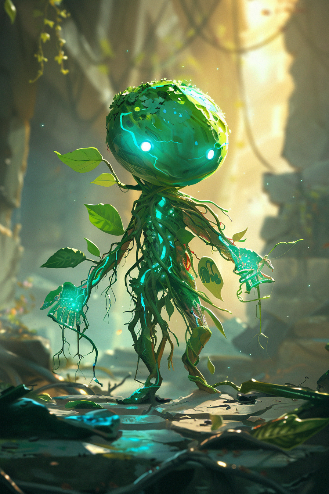
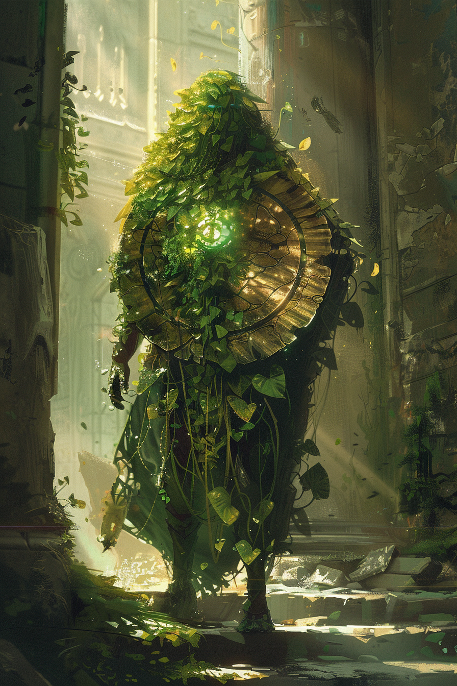
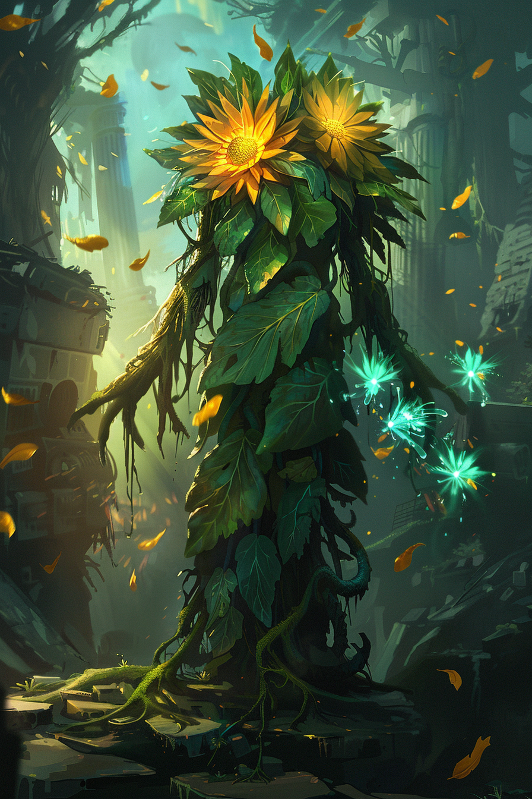
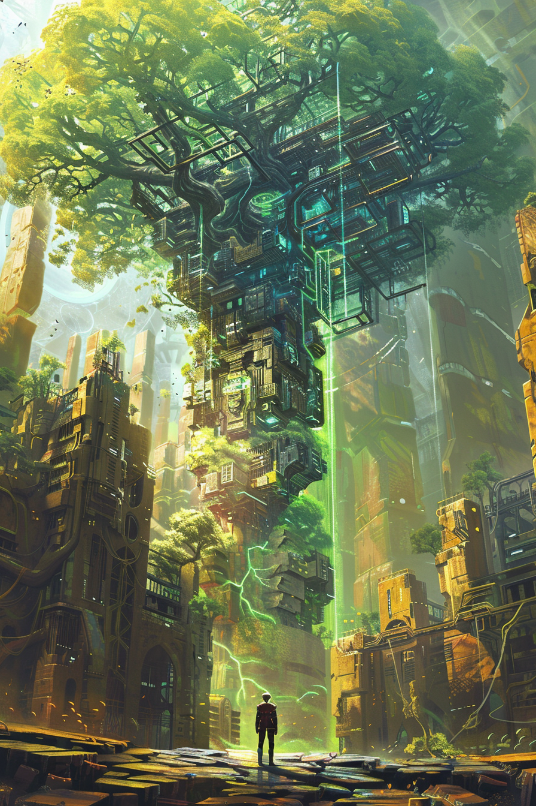

# Карты: Оазис

[🃏 Все карты](../README.md) · [📖 Лор фракции](../../docs/factions/oasis.md) · [🎨 Цвета и обзор](../../docs/factions/_overview.md)

**Цветение X** — лечит всех своих существ каждый ход. Архетип: лечащий контроль. Цвет  `#2ECC71` +  `#00CED1`. *(DLC 2)*

| Арт | Карта | Тип | Мана | А/З | Ред. | Способность |
|:--:|---|---|:--:|:--:|:--:|---|
|  | [Флора, Хранительница Сада](../heroes/oasis-keeper.md) | герой | — | 30 | ★ | **Полив:** `+3` здоровья всем союзным существам |
|  | [Росток](../minions/oasis-sprout.md) | существо | 2 | 1/3 | common | **Цветение 1** |
|  | [Солнечный щит](../minions/oasis-sun-shield.md) | существо | 4 | 1/6 | rare | **Провокация. Цветение 1** |
|  | [Буйный рост](../spells/oasis-photo-bloom.md) | заклинание | 4 | — | epic | Союзнику `+2/+2` и **Цветение 1** |
|  | [Двуцвет](../minions/oasis-twin-bloom.md) | существо | 5 | 2/6 | epic | **Цветение 2** |
|  | [Древо, Корень Оазиса](../minions/oasis-worldroot.md) | существо | 8 | 3/9 | ★ | **Провокация. Цветение 3** |

---

**Другие фракции:** [Шакалы](jackals.md) · [Пепел](ash.md) · [Химеры](chimera.md) · [Бастион](bastion.md) · [Сеть](net.md) · [Мираж](mirage.md)
