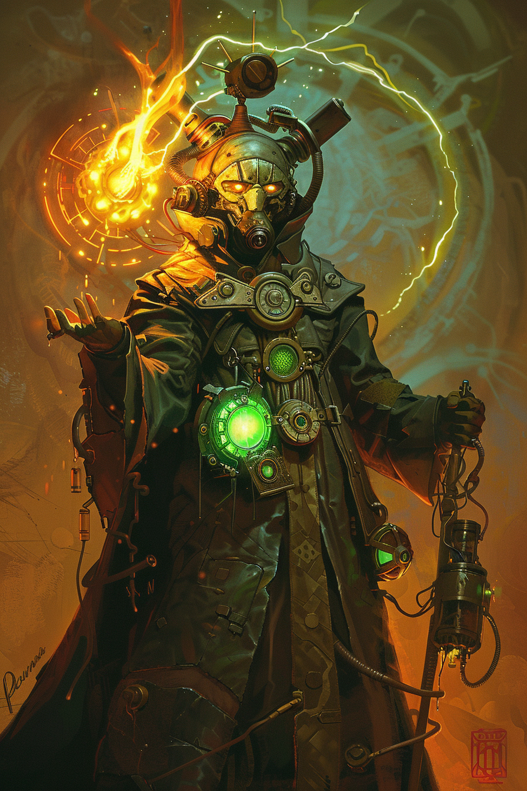

*«Терпение, дети. Огонь не спешит. Огонь просто не гаснет.»*

## Способность
**Сила героя (2 маны) — «Разогрев»:** дать дружественному существу `+2` к атаке немедленно.
*(ускоряет накал **Перегрева** — приближает разрушительный Сброс на ход раньше)*

**LED:** правая полоса целевого юнита прибавляет `2` LED оранжевой вспышкой; полоса маны героя гаснет на `2` LED.

---

🃏 [Все карты](../README.md) · 🗂 [Карты: Пепел](../factions/ash.md) · 📖 [Лор: Пепел](../../docs/factions/ash.md)
