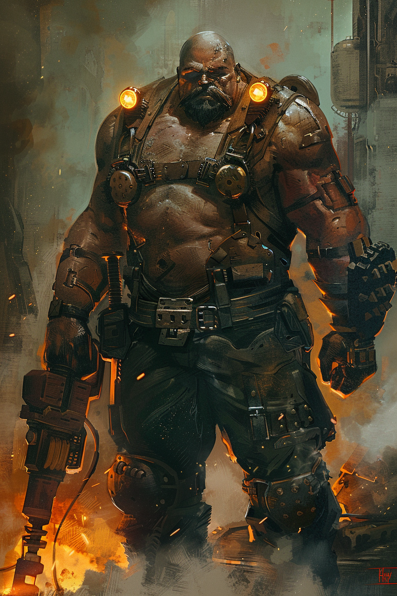

*«Я не воюю. Я заклёпываю. Разница в том, что заклёпанное держится дольше войны.»*

## Способность
**Сила героя (2 маны) — «Заклепать»:** дать дружественному существу `+3` Брони (в пределах `здоровье + Броня ≤ 12`).
*(точечно превращает любое тело в стену; излишек сверх `12` не накладывается)*

**LED:** на левой полосе целевого юнита добавляется до `3` янтарных делений **Брони** поверх здоровья; полоса маны героя гаснет на `2` LED.

---

🃏 [Все карты](../README.md) · 🗂 [Карты: Бастион](../factions/bastion.md) · 📖 [Лор: Бастион](../../docs/factions/bastion.md)
