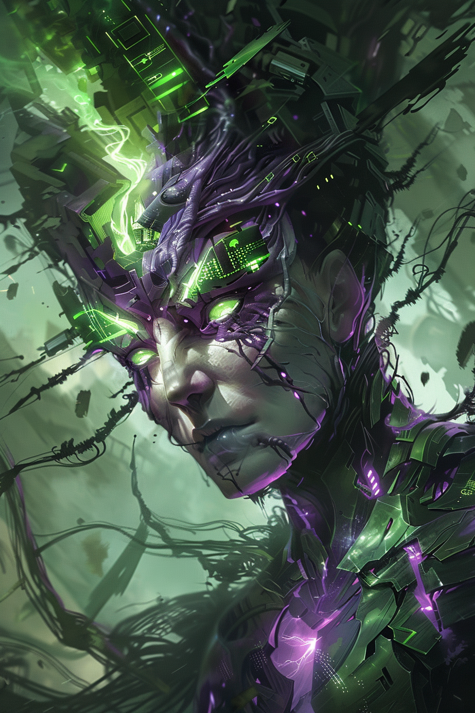

*«Первое поколение плакало. Второе терпело. Я — третье. Я выбираю форму.»*

## Способность
**Сила героя (2 маны) — «Стимул»:** активировать **Адаптацию** дружественного существа немедленно, без получения урона (усиление выбираете сейчас).
*(снимает встроенное условие «пережить урон» — даёт ценность по требованию)*

**LED:** целевое существо проигрывает анимацию **Адаптации** (фиолетово-зелёная вспышка верхней полосы + индикатор выбранного усиления); полоса маны героя гаснет на `2` LED.

---

🃏 [Все карты](../README.md) · 🗂 [Карты: Химеры](../factions/chimera.md) · 📖 [Лор: Химеры](../../docs/factions/chimera.md)
