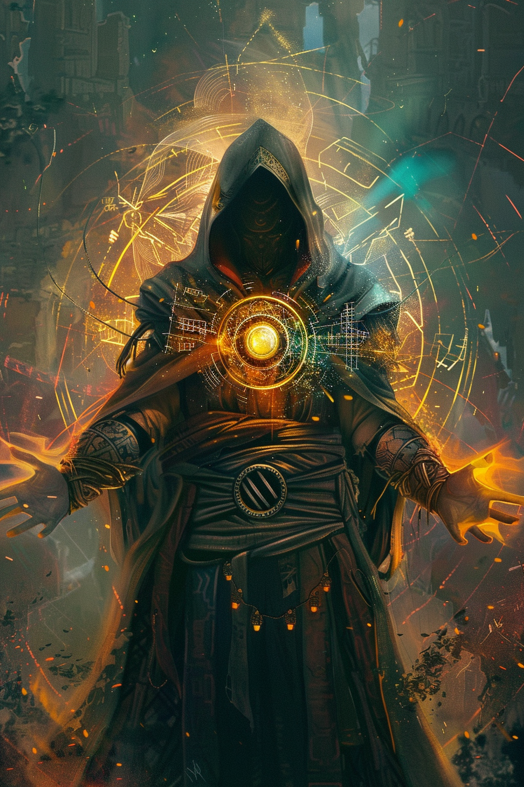

*«Я не колдую. Я лишь настраиваю антенну так, чтобы мир ответил дважды.»*

## Способность
**Сила героя (2 маны) — «Двоение»:** следующее разыгранное вами заклинание в этот ход срабатывает дважды.
*(превращает любой бёрст или утилити-спелл в комбо; цель второго срабатывания выбирается заново)*

**LED:** ячейка героя коротко двоится мадженовым (статусный акцент на полосе маны); полоса маны героя гаснет на `2` LED. При разрешении удвоенного заклинания эффект отрисовывается двойной вспышкой.

---

🃏 [Все карты](../README.md) · 🗂 [Карты: Мираж](../factions/mirage.md) · 📖 [Лор: Мираж](../../docs/factions/mirage.md)
