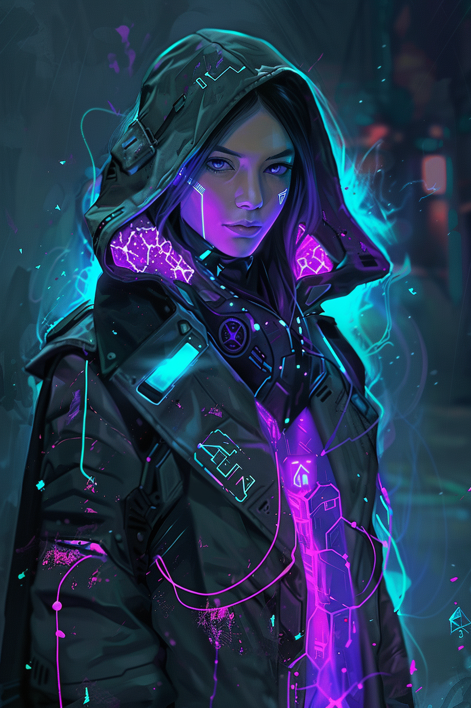

*«У тебя был пароль. Был. Прошедшее время — моя любимая грамматика.»*

## Способность
**Сила героя (2 маны) — «Глушилка»:** **Заглушить** вражеское существо до начала вашего следующего хода (снять ключевые слова и текст способностей; атаковать оно при этом может).
*(дешёвая нейтрализация ключевого врага без полного **Взлома** — тело остаётся, но «зубы» сняты)*

**LED:** верхняя полоса целевого существа становится серой (**Заглушён**) до начала вашего следующего хода; полоса маны героя гаснет на `2` LED.

---

🃏 [Все карты](../README.md) · 🗂 [Карты: Сеть](../factions/net.md) · 📖 [Лор: Сеть](../../docs/factions/net.md)
