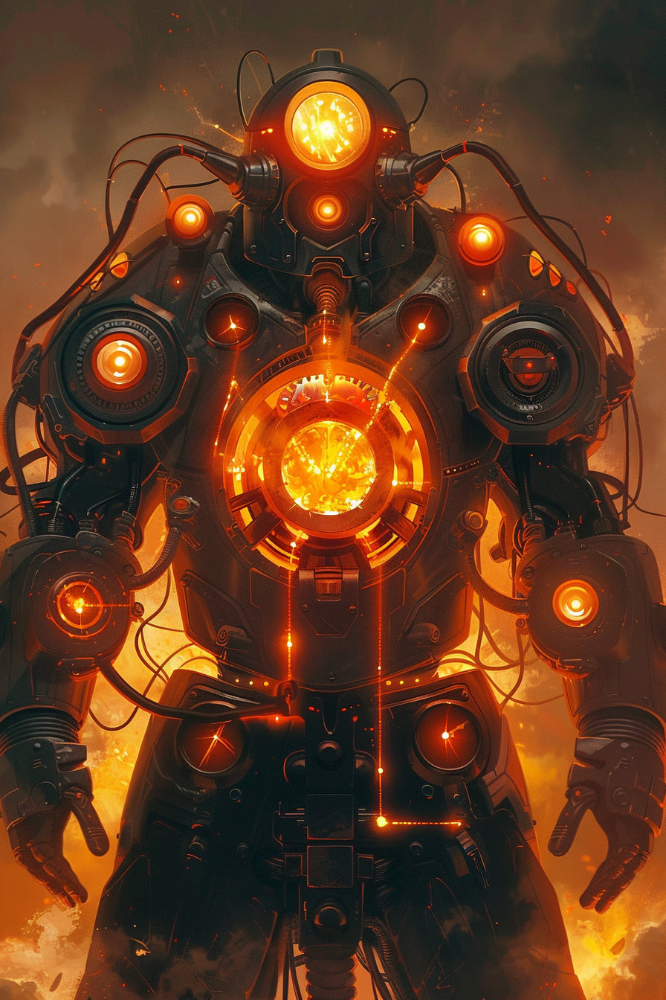

*«Тот самый огонь, что не погас под землёй. Он помнит, как горело небо.»*

## Способность
**Провокация. Перегрев.** Когда это существо совершает **Сброс** — вражеский герой получает урон, равный половине нанесённого (округление вниз).
*(легендарная стена-бомба `3/7`: копит атаку под прикрытием Провокации; Сброс бьёт цель и обдаёт героя половиной урона. Уникальная — одна в колоде)*

**LED:** верхняя полоса — флаг **Провокации**. Правая полоса растёт на `1` LED в начале хода; при **Сбросе** — оранжевая вспышка `40` LED, затем по полосе здоровья вражеского героя проходит дополнительная оранжевая волна на половину урона.

---

🃏 [Все карты](../README.md) · 🗂 [Карты: Пепел](../factions/ash.md) · 📖 [Лор: Пепел](../../docs/factions/ash.md)
