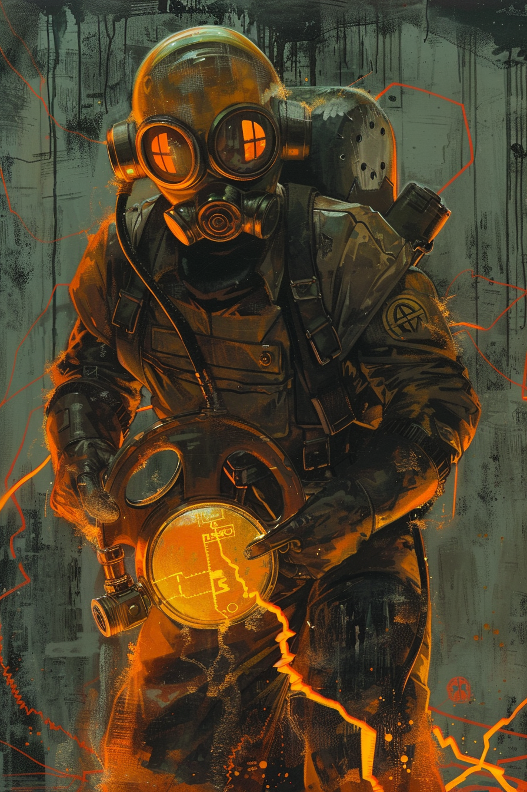

*«Счётчик трещит — значит, литургия идёт по плану.»*

## Способность
**Перегрев.**
*(существо `1/3`: в начале каждого вашего хода `+1` к атаке. **Сброс** (вместо обычной атаки): нанести любой цели урон, равный текущей атаке, затем вернуть атаку к базовой `1`. Без ответного урона. Атака не выше `12`)*

**LED:** правая полоса растёт на `1` LED в начале каждого хода — точный урон будущего Сброса. При **Сбросе** — оранжевая вспышка всех `40` LED, затем правая полоса возвращается к `1`.

---

🃏 [Все карты](../README.md) · 🗂 [Карты: Пепел](../factions/ash.md) · 📖 [Лор: Пепел](../../docs/factions/ash.md)
