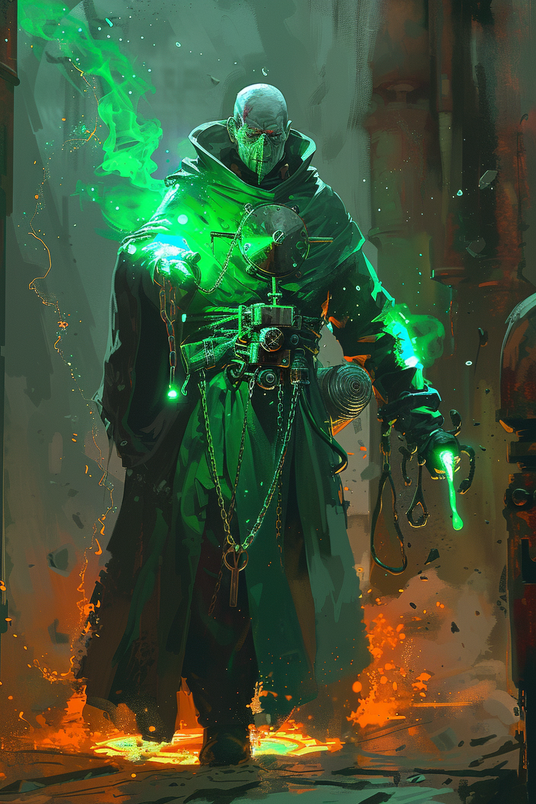

*«Терпение — первая из атомных добродетелей. Вторая — критическая масса.»*

## Способность
**Провокация. Перегрев.**
*(стена `2/5`: враги обязаны атаковать её. В начале каждого хода `+1` к атаке; **Сброс** бьёт любую цель на текущую атаку и сбрасывает её к базовой `2`. Стена, что ход за ходом копит точечную бомбу)*

**LED:** верхняя полоса — флаг **Провокации**. Правая полоса растёт на `1` LED в начале хода; при **Сбросе** — оранжевая вспышка `40` LED и возврат к `2`.

---

🃏 [Все карты](../README.md) · 🗂 [Карты: Пепел](../factions/ash.md) · 📖 [Лор: Пепел](../../docs/factions/ash.md)
