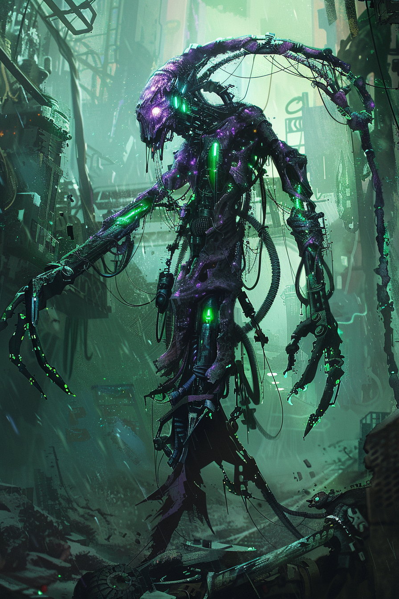

*«Удар не убил его. Удар его доделал.»*

## Способность
**Адаптация** (`+2` к атаке / `+2` здоровья / **Досягаемость**).
*(существо `3/4`: пережив первый урон, по выбору игрока становится крупнее, живучее или дотягивается до **воздушных** целей. Один раз за игру)*

**LED:** при срабатывании — фиолетово-зелёная вспышка верхней полосы; затем индикатор усиления (красный = атака, зелёный = здоровье, LED-флаг **Досягаемости** на верхней полосе).

---

🃏 [Все карты](../README.md) · 🗂 [Карты: Химеры](../factions/chimera.md) · 📖 [Лор: Химеры](../../docs/factions/chimera.md)
