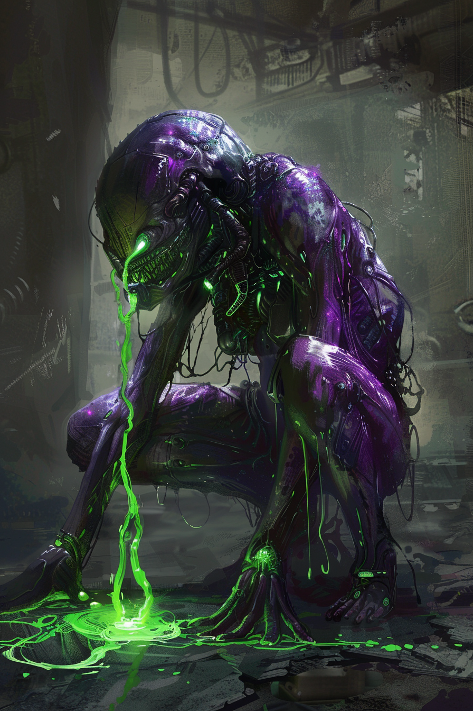

*«Сначала оно шипит. Потом ты понимаешь, что шипит уже твоя кожа.»*

## Способность
**Адаптация** (`+2` к атаке / `+2` здоровья / **Утилизация**).
*(существо `2/3`: впервые пережив урон, получает одно постоянное усиление по выбору игрока. Срабатывает один раз за игру)*

**LED:** при срабатывании — фиолетово-зелёная вспышка верхней полосы, затем загорается индикатор выбранного усиления (красный = атака, зелёный = здоровье, LED-флаг **Утилизации**).

---

🃏 [Все карты](../README.md) · 🗂 [Карты: Химеры](../factions/chimera.md) · 📖 [Лор: Химеры](../../docs/factions/chimera.md)
