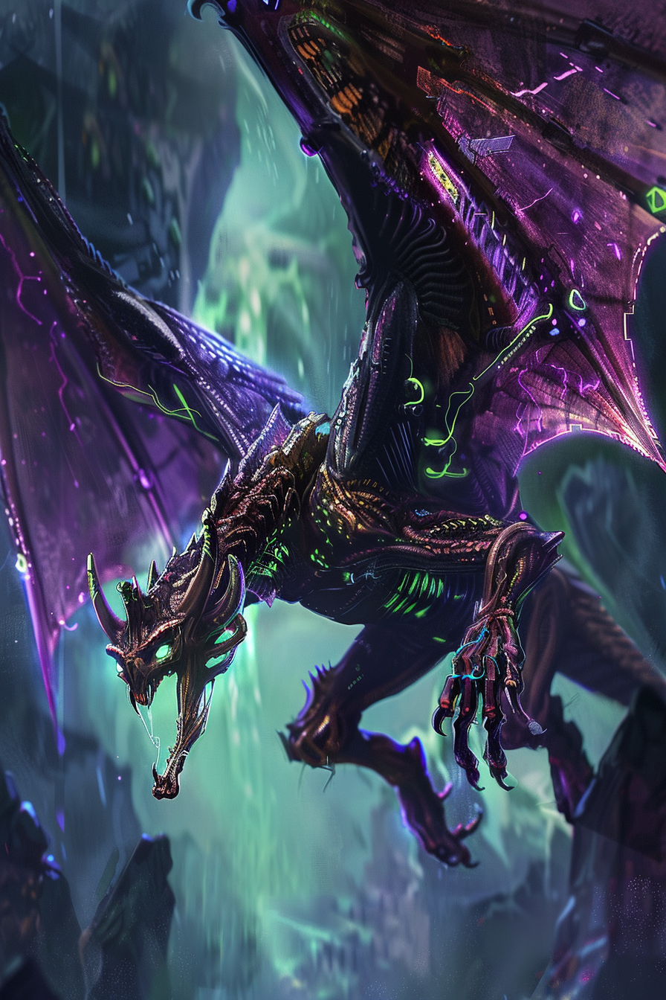

*«Третье поколение отрастило крылья. Никто не просил — оно просто решило, что так удобнее.»*

## Способность
**Воздушный. Адаптация** (`+2` к атаке / `+2` здоровья / **Спешка**).
*(существо `3/4`, **воздушное**: уязвимо только для воздушных и **Досягаемости**, само бьёт любые цели. Пережив первый урон — усиление по выбору. `воздушный` заложен в цену ~`+1`)*

**LED:** верхняя полоса — флаг типа **воздушный**. При **Адаптации** — фиолетово-зелёная вспышка, затем индикатор выбранного усиления.

---

🃏 [Все карты](../README.md) · 🗂 [Карты: Химеры](../factions/chimera.md) · 📖 [Лор: Химеры](../../docs/factions/chimera.md)
