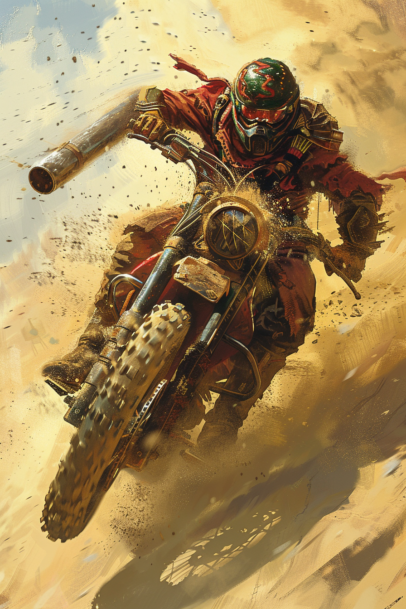

*«Тормозов нет. Тормоза — для тех, кто собирается вернуться.»*

## Способность
**Спешка. Свора 2.**
*(существо `2/1`: может атаковать в ход выставления; получает `+1` к атаке за каждое другое дружественное существо, максимум `+2`)*

**LED:** верхняя полоса — флаг **Спешки**. Правая полоса показывает атаку с учётом Своры; пульсирует песочно-жёлтым при изменении состава поля.

---

🃏 [Все карты](../README.md) · 🗂 [Карты: Шакалы](../factions/jackals.md) · 📖 [Лор: Шакалы](../../docs/factions/jackals.md)
