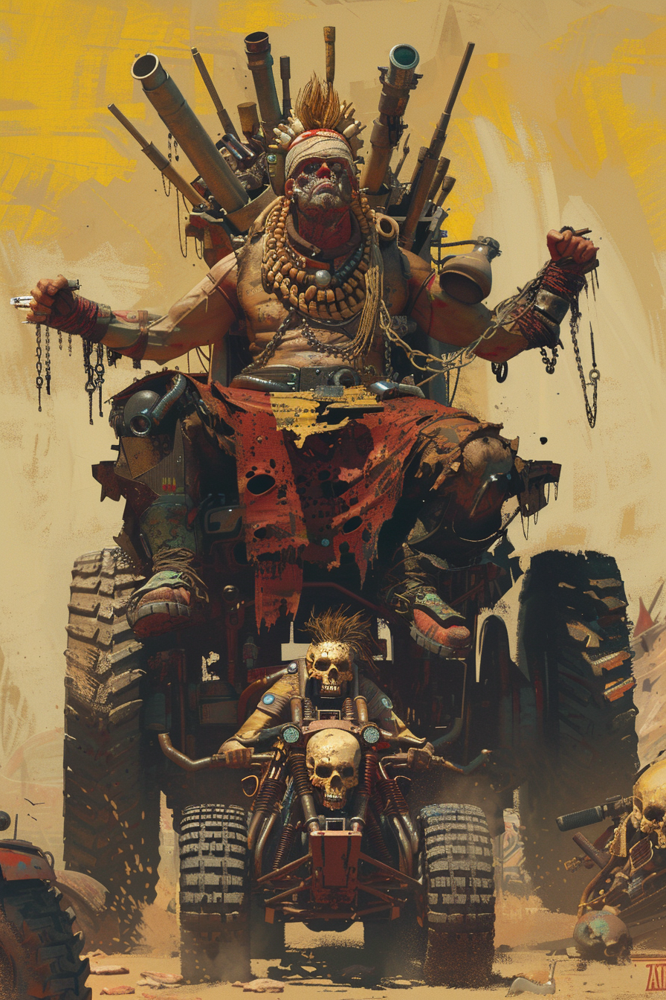

*«Свалка не выбирает короля. Король — тот, кто остался стоять на её вершине.»*

## Способность
**Спешка. Свора 4. Боевой клич:** другие дружественные существа получают `+1` к атаке до конца хода.
*(легендарный финишер своры: на полном фланге сам бьёт как `8/4` сразу, а вся стая — больнее. База `4 + X = 8` ≤ `12`)*

**LED:** верхняя полоса — флаг **Спешки**. При выходе правые полосы всех других дружественных существ вспыхивают песочно-жёлтым (`+1` LED до конца хода); собственная правая полоса показывает атаку с учётом Своры.

---

🃏 [Все карты](../README.md) · 🗂 [Карты: Шакалы](../factions/jackals.md) · 📖 [Лор: Шакалы](../../docs/factions/jackals.md)
