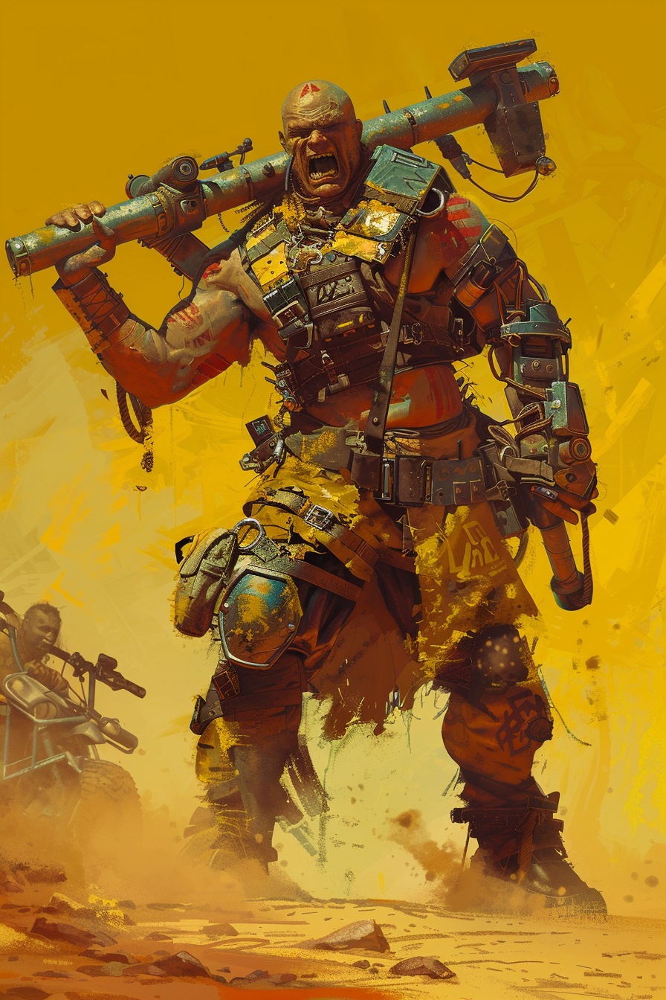

*«Один удар — одна труба. Десять труб — десять ударов разом.»*

## Способность
**Свора 3.**
*(существо `3/3`: получает `+1` к атаке за каждое другое дружественное существо, максимум `+3` — на полном фланге бьёт как `6/3`. Сумма `база + X = 6` ≤ `12`)*

**LED:** правая полоса показывает текущую атаку с учётом Своры; пульсирует песочно-жёлтым при изменении состава поля.

---

🃏 [Все карты](../README.md) · 🗂 [Карты: Шакалы](../factions/jackals.md) · 📖 [Лор: Шакалы](../../docs/factions/jackals.md)
