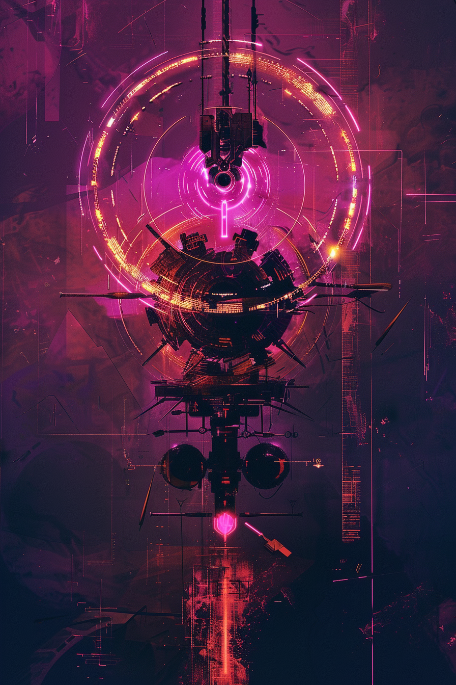

*«Узел не бьёт сам. Он просто заставляет один удар случиться дважды.»*

## Способность
**Эхо. При атаке:** нанести `1` урона случайному вражескому существу.
*(существо `2/4`: каждый раз, когда атакует, **Эхо** удваивает триггер — `1` урона двум случайным врагам. Чистит мелочь, пока бьёт телом)*

**LED:** верхняя полоса — флаг **Эхо**. При атаке двойная мадженовая вспышка; левые полосы двух случайных врагов гаснут на `1` LED.

---

🃏 [Все карты](../README.md) · 🗂 [Карты: Мираж](../factions/mirage.md) · 📖 [Лор: Мираж](../../docs/factions/mirage.md)
