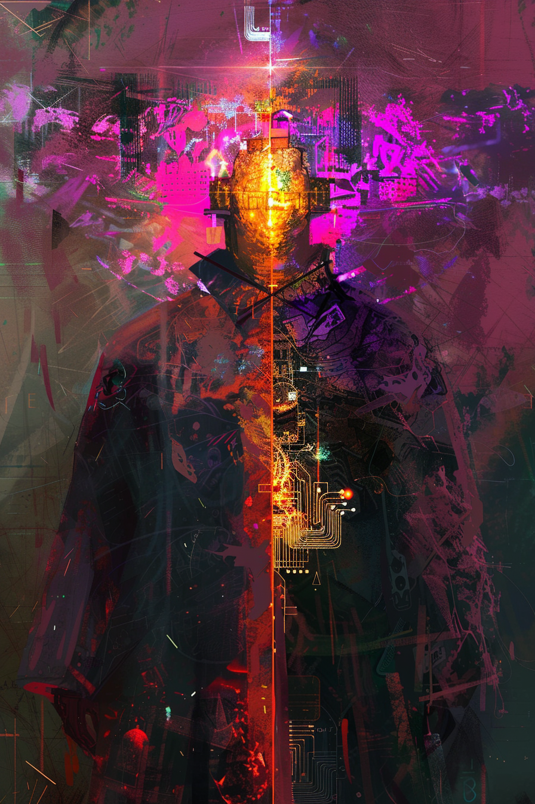

*«Который из них настоящий? Оба. Ни один. Спроси у того, по кому он только что ударил.»*

## Способность
**Эхо. Боевой клич:** нанести `3` урона любой цели.
*(легендарный гибкий удар `4/5`: **Эхо** повторяет клич — два разряда по `3` в любые цели (`6` в одну морду или раздельно по существам). Уникальная — одна в колоде)*

**LED:** верхняя полоса — флаг **Эхо**. При выходе по ячейке-источнику двойная мадженовая вспышка; левые полосы двух выбранных целей (или полоса героя) гаснут на `3` LED поочерёдно.

---

🃏 [Все карты](../README.md) · 🗂 [Карты: Мираж](../factions/mirage.md) · 📖 [Лор: Мираж](../../docs/factions/mirage.md)
