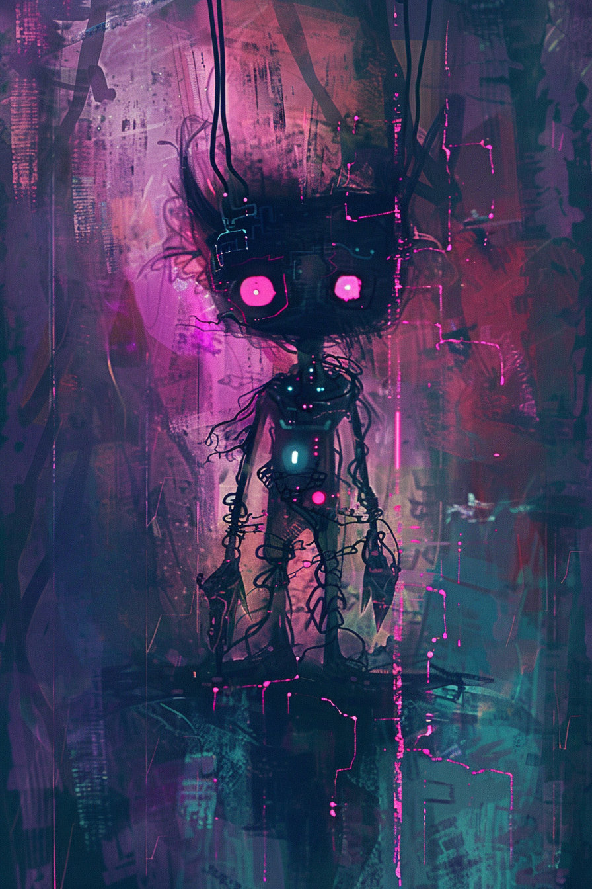

*«Ты ударил одного. Второй стоял рядом и смеялся. Это был тот же самый.»*

## Способность
**Эхо. Боевой клич:** нанести `1` урона вражескому существу.
*(существо `2/2`: **Эхо** повторяет клич — два удара по `1`, цель второго выбирается заново, можно в двух разных врагов)*

**LED:** верхняя полоса — флаг **Эхо**. При выходе по ячейке-источнику проходит двойная мадженовая вспышка; левые полосы двух целей гаснут на `1` LED поочерёдно.

---

🃏 [Все карты](../README.md) · 🗂 [Карты: Мираж](../factions/mirage.md) · 📖 [Лор: Мираж](../../docs/factions/mirage.md)
