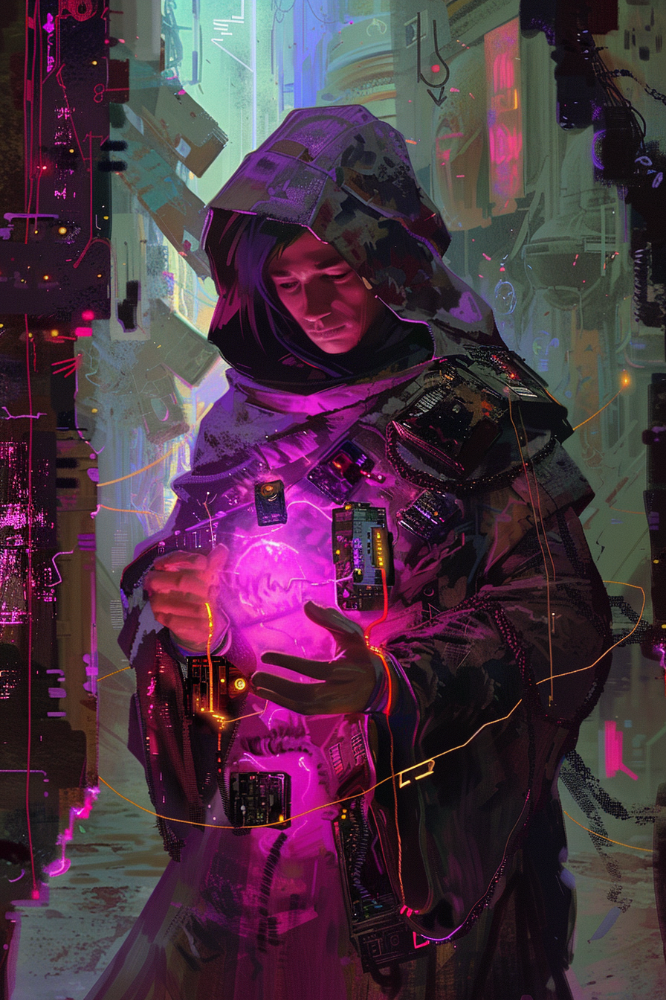

*«Он молится дважды одной молитвой. Аномалия слышит обе.»*

## Способность
**Эхо. Конец хода:** восстановить `2` здоровья герою.
*(существо `2/3`: **Эхо** удваивает триггер — `4` здоровья герою каждый конец хода. Тихий движок сустейна для комбо-колоды)*

**LED:** верхняя полоса — флаг **Эхо**. В конце хода по ячейке-источнику двойная мадженовая вспышка; полоса здоровья героя дважды прибавляет по `2` LED.

---

🃏 [Все карты](../README.md) · 🗂 [Карты: Мираж](../factions/mirage.md) · 📖 [Лор: Мираж](../../docs/factions/mirage.md)
