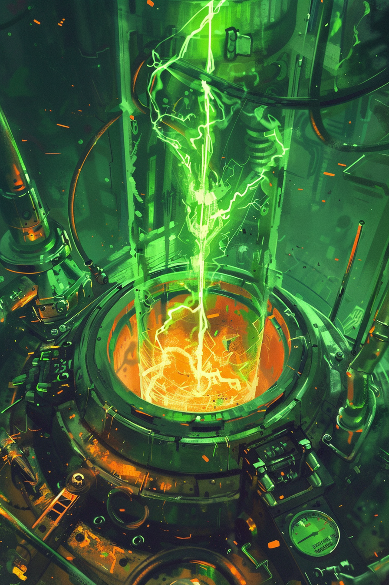

*«Достаточно поднести два осколка достаточно близко.»*

## Способность
Нанести `5` урона любой цели. **Перегрузка 1.**
*(точечный разряд по существу или герою; в следующий ход максимум маны снижен на `1`)*

**LED:** левая полоса цели гаснет на `5` LED оранжевой вспышкой. Полоса маны героя в начале следующего хода показывает `−1` (**Перегрузка**).

---

🃏 [Все карты](../README.md) · 🗂 [Карты: Пепел](../factions/ash.md) · 📖 [Лор: Пепел](../../docs/factions/ash.md)
