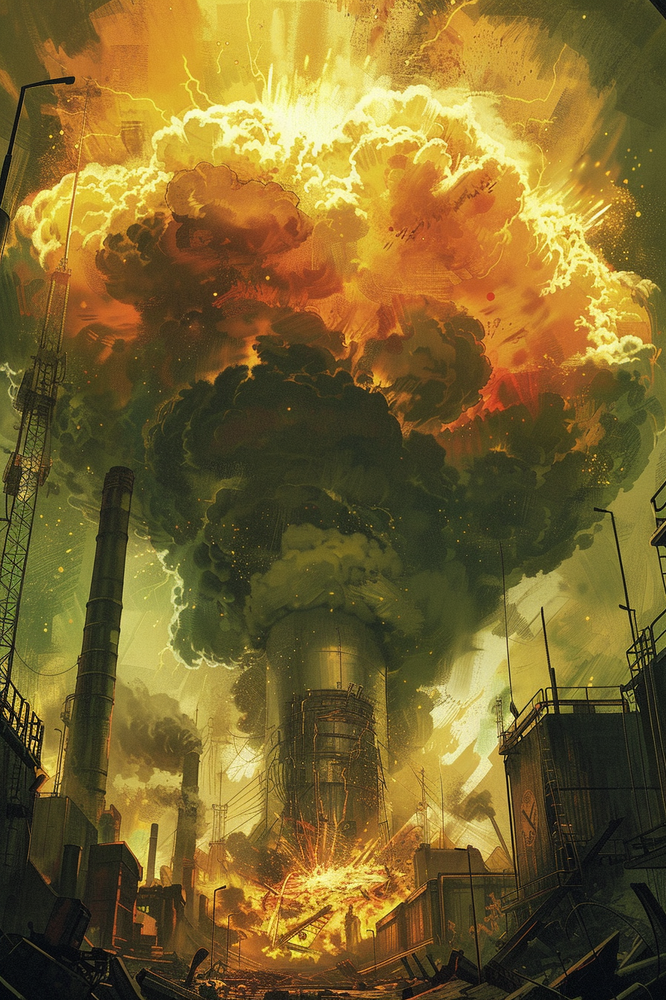

*«Реактор не злится. Реактор просто выдыхает.»*

## Способность
Нанести `2` урона **всем** вражеским существам.
*(базовая чистка против go-wide, в т.ч. против **Своры** Шакалов; не задевает дружественных и героев)*

**LED:** левые полосы (здоровье) всех вражеских существ одновременно гаснут на `2` LED оранжево-зелёной волной.

---

🃏 [Все карты](../README.md) · 🗂 [Карты: Пепел](../factions/ash.md) · 📖 [Лор: Пепел](../../docs/factions/ash.md)
