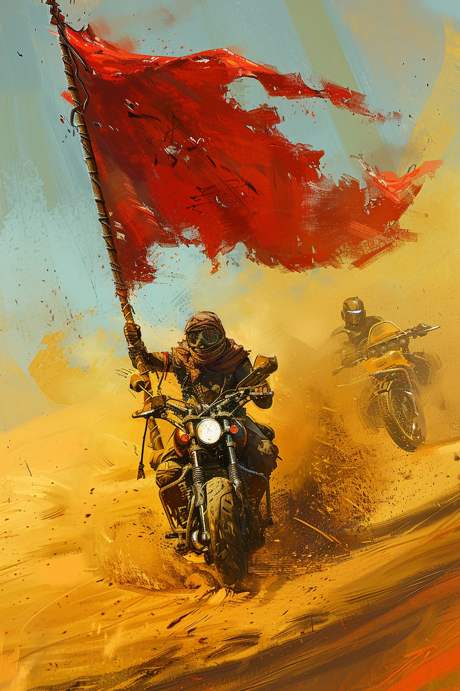

*«Когда поднимается дым — поднимается вся стая.»*

## Способность
Дать **всем** дружественным существам `+1` к атаке до конца хода.
*(go-wide финишер: чем шире фланг, тем больше суммарный урон; складывается со **Сворой**)*

**LED:** правые полосы всех дружественных существ одновременно прибавляют `1` LED и вспыхивают песочно-жёлтым; в конце хода возвращаются к прежнему значению.

---

🃏 [Все карты](../README.md) · 🗂 [Карты: Шакалы](../factions/jackals.md) · 📖 [Лор: Шакалы](../../docs/factions/jackals.md)
