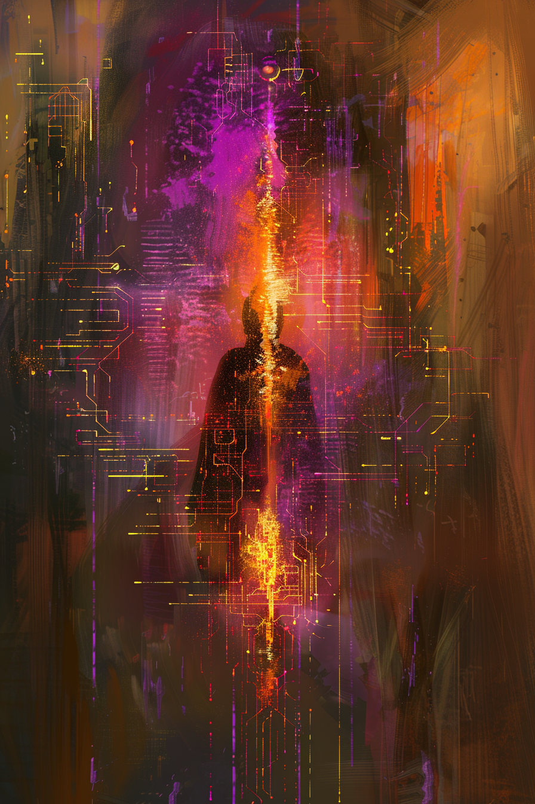

*«Куда целиться, если целей две, а настоящая — ни одна?»*

## Способность
Нанести `2` урона любой цели.
*(дешёвый разряд по существу или герою; под силой героя «Двоение» срабатывает дважды — `4` урона)*

**LED:** левая полоса цели (или полоса здоровья героя) гаснет на `2` LED мадженовой вспышкой.

---

🃏 [Все карты](../README.md) · 🗂 [Карты: Мираж](../factions/mirage.md) · 📖 [Лор: Мираж](../../docs/factions/mirage.md)
