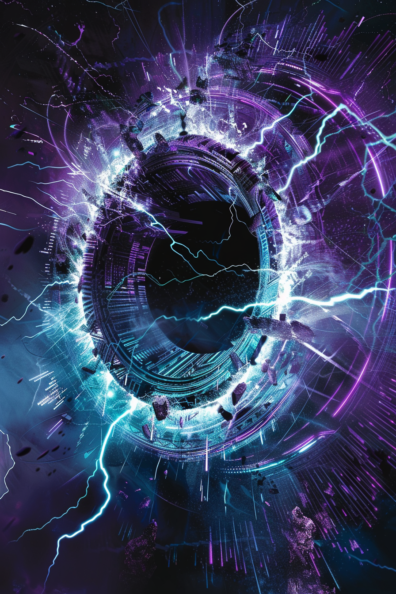

*«Сожги ему катушки. Дальше он сам себя добьёт.»*

## Способность
**Взломать** вражеское существо и нанести ему `2` урона.
*(удаление-лайт: цель вырублена на круг и подранена — но возвращается живой, если переживёт `2` урона)*

**LED:** рамка цели перекрашивается в голубой с глитч-эффектом, верхняя полоса гаснет (**Взлом**); левая полоса (здоровье) гаснет на `2` LED.

---

🃏 [Все карты](../README.md) · 🗂 [Карты: Сеть](../factions/net.md) · 📖 [Лор: Сеть](../../docs/factions/net.md)
