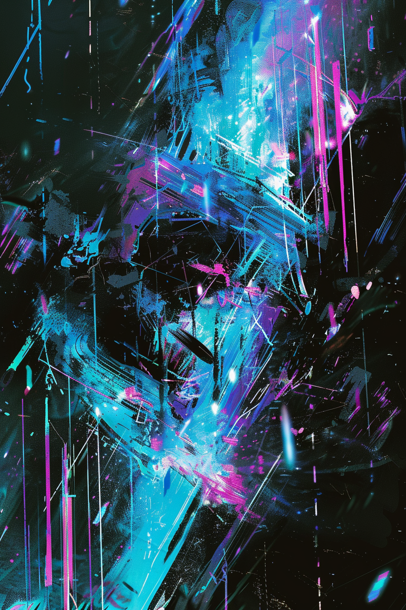

*«Один пакет не туда — и машина забывает, что она умела.»*

## Способность
**Заглушить** вражеское существо до начала вашего следующего хода. Потянуть карту.
*(темп + добор: снимает ключевые слова и текст с цели на круг и пополняет руку)*

**LED:** верхняя полоса цели становится серой (**Заглушён**); ячейка-источник коротко вспыхивает голубым в момент добора.

---

🃏 [Все карты](../README.md) · 🗂 [Карты: Сеть](../factions/net.md) · 📖 [Лор: Сеть](../../docs/factions/net.md)
