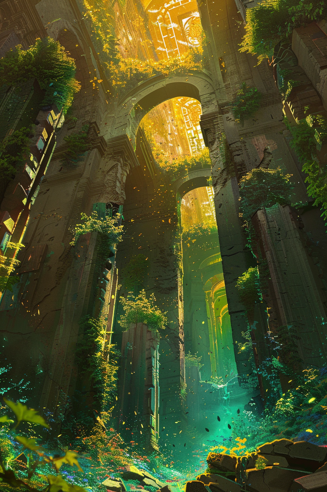

*«Дай ему свет и каплю воды — и он перерастёт всё, что ты построил.»*

## Способность
Дать дружественному существу `+2`/`+2` навсегда и **Цветение 1**.
*(превращает любое тело в источник лечения фланга; **Цветения** складываются с уже имеющимися)*

**LED:** у цели правая полоса `+2` LED, левая `+2` LED с зелёной вспышкой; на верхней полосе загорается флаг **Цветения**.

---

🃏 [Все карты](../README.md) · 🗂 [Карты: Оазис](../factions/oasis.md) · 📖 [Лор: Оазис](../../docs/factions/oasis.md)
