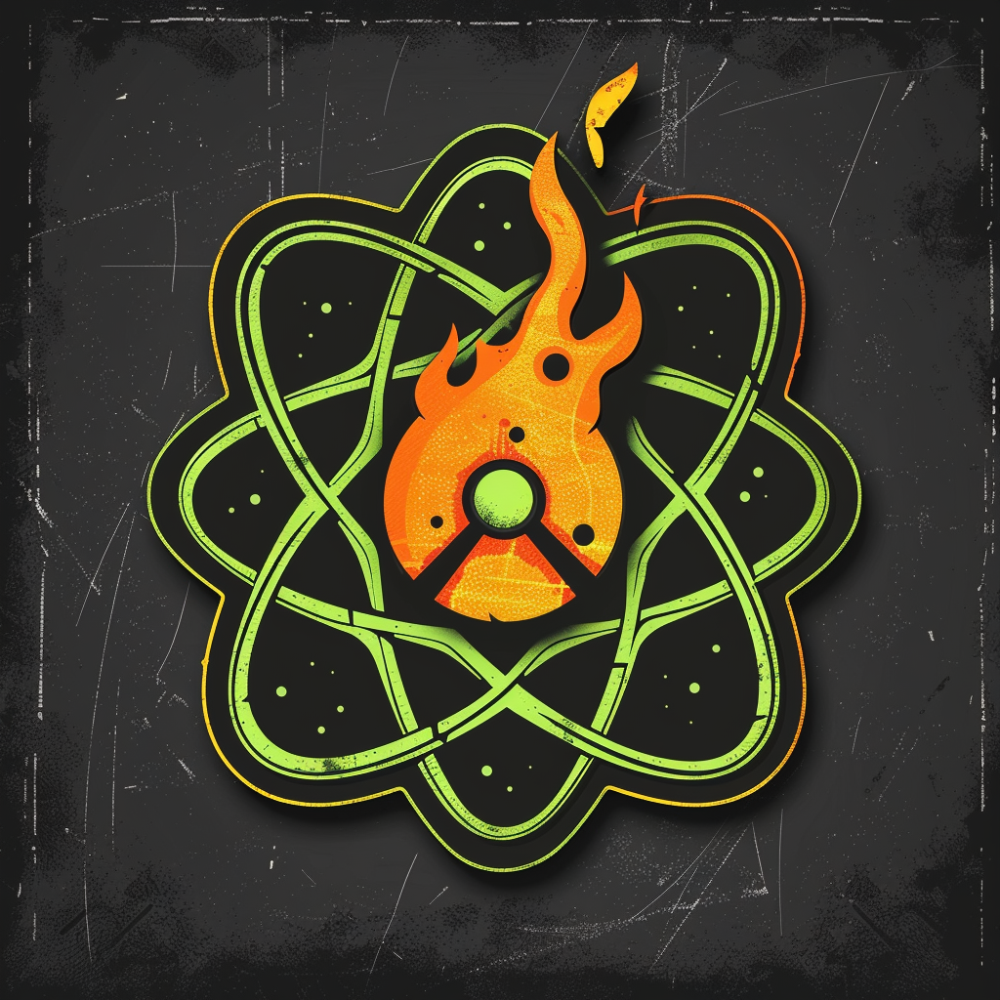

# Пепел *(ash)* — АТОМПАНК

Когда небо выгорело, один старый реактор не погас — он ушёл под землю и горит до сих пор. Пепел осели прямо над ним, в самом пекле, где другие не живут. Радиация для них не яд, а топливо: они научились её экранировать, закалять и кормить ею свои машины.

Их техника — тяжёлая, атомная, в духе ретрофутуризма 1950-х: ламповые контуры, свинцовая броня, реакторные батареи. Они медленнее всех. Зато их сила копится ход за ходом и срывается одним сокрушительным разрядом — когда враг уже думает, что выиграл темп.

Атом они превратили в веру, со жрецами и литургиями. Чужие зовут это безумием. Пепел зовёт это «не дать огню погаснуть второй раз».

*«Огонь нам дали дважды. Второй раз мы его удержим.»*
*Эстетика: хром и свинец, реакторное свечение, счётчики Гейгера, ретрофутуризм 1950-х, выжженная пустыня.*

**Цвет фракции:** `#C6FF00` + `#FF6600`

**Уникальная механика — Перегрев:**
В начале каждого вашего хода это существо получает `+1` к атаке (виден на правой полосе). **Активно — Сброс** (раз в ход, вместо обычной атаки): нанести любой цели — существу или герою — урон, равный **текущей атаке** этого существа, затем сбросить его атаку к базовой (напечатана на карте). Атака не растёт выше `12` (предел правой полосы). Сброс не вызывает ответного урона.
*LED: правая полоса (атака) растёт на `1` LED в начале каждого хода — игрок видит точный урон будущего Сброса. При Сбросе — оранжевая вспышка всех 40 LED, затем правая полоса возвращается к базовой атаке.*

**Сила героя (2 маны):** «Разогрев» — дать дружественному существу `+2` к атаке немедленно (ускоряет накал).
*LED: правая полоса целевого юнита прибавляет 2 LED.*

**Примеры существ:**
- *«Реакторный служка»* 1/4, 3 маны — **Перегрев**. *(копит атаку и сбрасывает её точечно в существо или героя)*
- *«Тепловой котёл»* 2/6, 5 маны — Провокация. **Перегрев**. *(стена, что ход за ходом превращается в бомбу)*
- *«Распадник»* 3/2, 4 маны — Спешка. **Перегрев**. *(давит сразу и тем больнее, чем дольше живёт)*

---

См. также: [Фракции — обзор](_overview.md) · [Конвенции LED](../hardware/led-conventions.md) · [Арт-система](../system/art-system.md)
