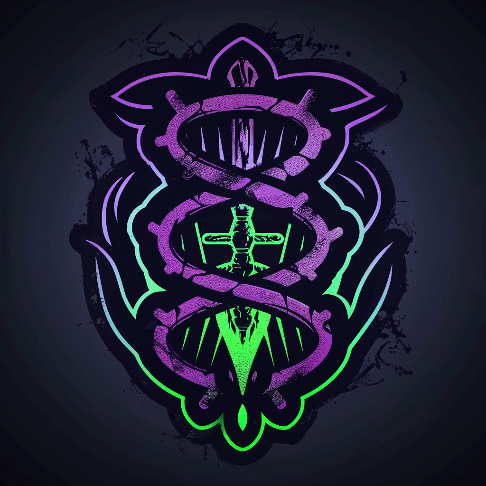
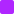
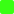

# Химеры *(chimera)* — МУТАЦИИ / ГЕНПАНК

Зной вскрыл старые био-лаборатории, и то, что текло в их чанах, вырвалось наружу — на людей, что были рядом. Первое поколение встретило это как проклятие. Третье уже не понимает, зачем кому-то жить иначе.

Тела Химер — живые машины: биолюминесцентная ткань, проросшая по органической кости, нити, что связывают общину в нечто среднее между стаей и единым организмом. Их техника органическая: генераторы на биохимии, оружие из секретирующих желёз, броня из хитина.

Главное их свойство простое: они меняются от боли. Каждое ранение — не ущерб, а толчок к новой форме. Ударь Химеру и не добей — сделаешь её опаснее.

*«Боль — это вопрос. Новая форма — ответ.»*
*Эстетика: органические формы без прямых углов, биолюминесценция, кость со встроенными схемами, влажные блестящие поверхности.*

**Цвет фракции:**  `#B026FF` +  `#39FF14`

**Уникальная механика — Адаптация:**
Когда это существо **впервые переживает урон** (после получения урона у него остаётся `≥1` здоровья) — оно немедленно получает одно постоянное усиление из набора, указанного на карте (`+2` к атаке / `+2` здоровья / ключевое слово). Усиление **выбирает игрок**. Адаптация срабатывает **один раз за игру**.
*LED: при срабатывании — фиолетово-зелёная вспышка верхней полосы; затем загорается индикатор выбранного усиления (зелёный = здоровье, красный = атака, LED соответствующего ключевого слова).*

**Сила героя (2 маны):** «Стимул» — активировать **Адаптацию** дружественного существа немедленно, без получения урона (вы выбираете усиление сейчас).
*LED: целевое существо проигрывает анимацию Адаптации.*

**Примеры существ:**
- *«Споровый зверь»* 2/4, 3 маны — **Адаптация** (`+2` к атаке / `+2` здоровья / Провокация).
- *«Кислотник»* 3/2, 3 маны — Спешка. **Адаптация** (`+2` к атаке / Утилизация / Досягаемость).
- *«Костяная тварь»* 2/6, 5 маны — Провокация. **Адаптация** (`+2` к атаке / `+2` здоровья / Спешка). *(пережив первый размен, превращается в угрозу)*

---

См. также: [🃏 Карты фракции](../../cards/factions/chimera.md) · [Фракции — обзор](_overview.md) · [Конвенции LED](../hardware/led-conventions.md) · [Арт-система](../system/art-system.md)
