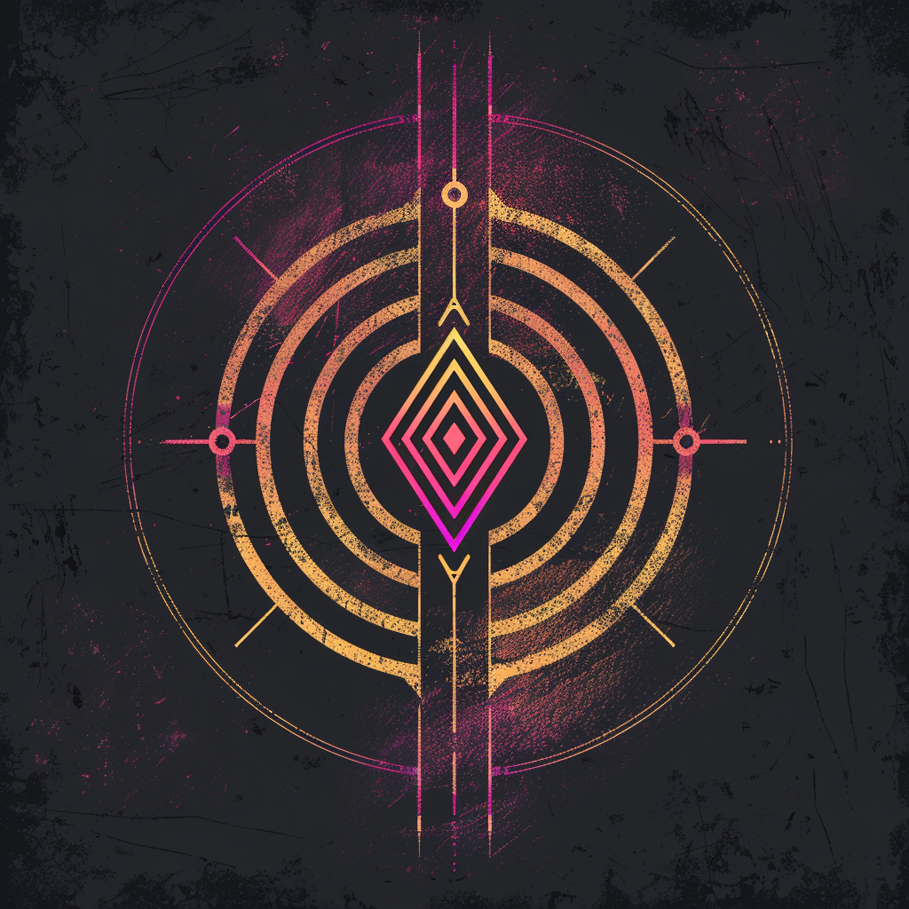

# Мираж *(mirage)* — АНОМАЛИИ | DLC 3

У самой Колыбели, в центре пустыни, Зной погнул не только песок, но и физику. Там электроника оживает без питания, тени отстают от тел, а одно событие случается дважды. Жить там нельзя. Кроме Миража.

Они обнаружили: аномальное поле можно настроить. Определённые схемы резонируют с ним — и тогда любое действие отдаётся эхом, повторяется само собой. Их амулеты — это антенны нужного профиля, их ритуалы — протоколы настройки. Со стороны это выглядит как магия, и Мираж давно перестал спорить, магия оно или нет.

Они ближе всех к призу мира — и потому их опаснее всех недооценивать.

*«Достаточно странная физика неотличима от чуда. Мы предпочитаем чудеса.»*
*Эстетика: дрожащий мадженовый воздух, двоящиеся силуэты, паяные амулеты-антенны, старая электроника как ритуальные предметы, золотые искажения.*

**Цвет фракции:**  `#FF00E5` +  `#FFB300`

**Уникальная механика — Эхо:**
Когда срабатывает способность этого существа (Боевой клич, эффект при атаке, при гибели, активная способность и т.п.) — она срабатывает **второй раз**. Для нацеленных эффектов цель второго срабатывания выбирается заново. Эхо повторяет эффект **только один раз**; повторное срабатывание само Эхо не запускает (цепочек нет). Эхо применимо к одиночным и случайным эффектам; на постоянные пассивки (вроде Провокации) не действует.
*LED: при разрешении способности по ячейке-источнику проходит двойная мадженовая вспышка (эффект «двоится»).*

**Сила героя (2 маны):** «Двоение» — следующее разыгранное вами заклинание в этот ход срабатывает дважды.
*LED: ячейка героя коротко двоится мадженовым (статусный акцент на полосе маны).*

**Примеры существ:**
- *«Двойник»* 3/2, 4 маны — **Эхо**. Боевой клич: нанести `2` урона вражескому существу. *(с Эхо — два удара по `2`, можно в две цели)*
- *«Зеркальный страж»* 2/4, 4 маны — Провокация. **Эхо**. Конец хода: восстановить `1` здоровья герою. *(Эхо удваивает до `2`)*
- *«Эхо-нода»* 2/3, 3 маны — **Эхо**. При атаке: нанести `1` урона случайному вражескому существу. *(бьёт двух случайных врагов)*

---

См. также: [🃏 Карты фракции](../../cards/factions/mirage.md) · [Фракции — обзор](_overview.md) · [Конвенции LED](../hardware/led-conventions.md) · [Арт-система](../system/art-system.md)
