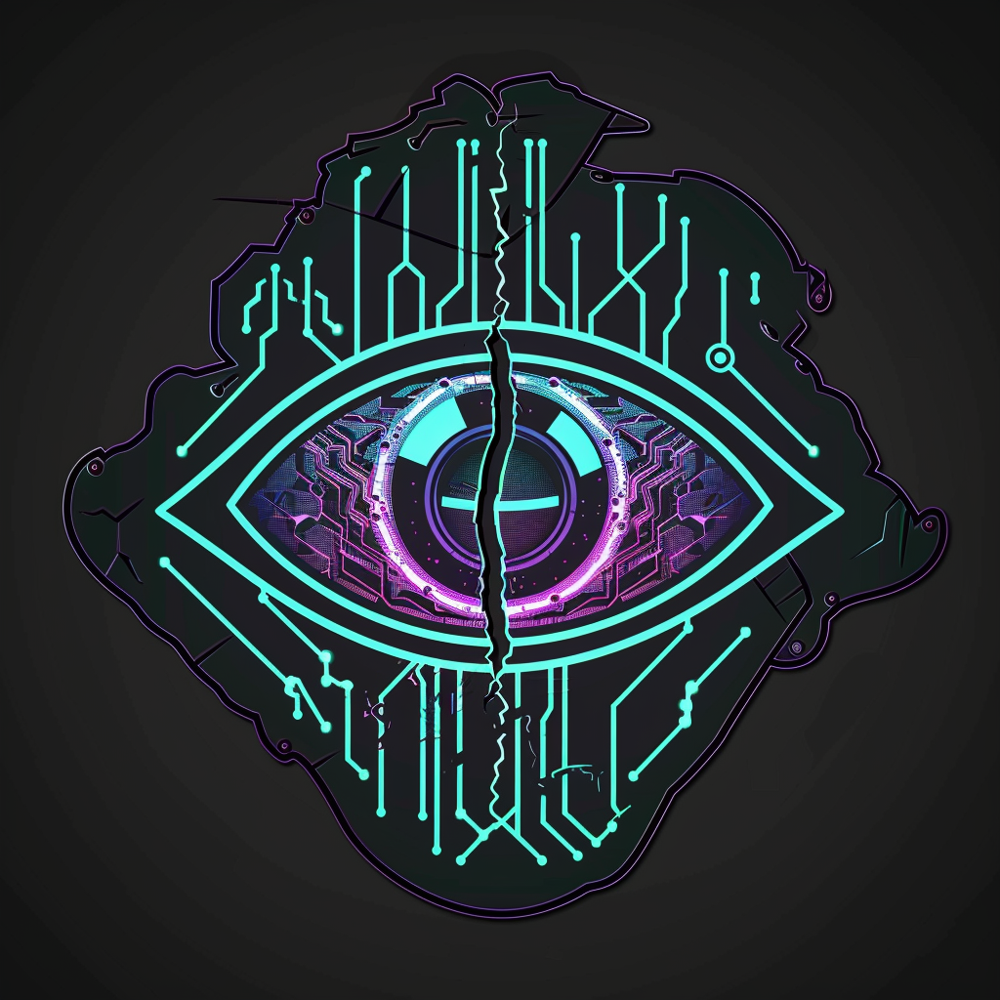

# Сеть *(net)* — КИБЕРПАНК | DLC 1

После Зноя всемирная сеть старого мира не исчезла — она осталась лежать в руинах, обесточенная и опасная. Сеть — те, кто научился нырять в эту мёртвую сеть и выныривать с добычей, не дав себя поймать.

Бывшие спецы по кибербезопасности, военные хакеры, подпольные нейромодеры. Импланты у них есть — но они сами выбрали какие. Их сила не в лобовом бою, а в том, чтобы вырубить чужую машину в нужный момент: заглушить, перехватить управление, отключить — и ударить, пока враг слеп. Они не сильнее. Они просто не дают противнику пользоваться тем, что у него есть.

*«Нет защищённых систем. Есть только те, до которых мы ещё не добрались.»*
*Эстетика: неон в темноте, хром под кожей, тактические AR-очки, голографические потоки данных, глитч по краям.*

**Цвет фракции:**  `#00E5FF` +  `#7C4DFF`

**Уникальная механика — Взлом:**
Выключить вражеское существо до начала вашего следующего хода: оно **не может атаковать**, **не использует способности** и **теряет все ключевые слова** (по сути — Заглушён и обездвижен на один круг). По истечении срока существо возвращается в норму со всеми исходными ключевыми словами.
*LED: вся рамка взломанного юнита перекрашивается в  `#00E5FF` с глитч-эффектом; верхняя полоса гаснет (все ключевые слова сняты).*

**Сила героя (2 маны):** «Глушилка» — **Заглушить** вражеское существо до начала вашего следующего хода (снять ключевые слова и текст способностей; атаковать оно при этом может).
*LED: у целевого существа верхняя полоса становится серой (Заглушён).*

**Примеры существ:**
- *«Взломщик»* 2/3, 3 маны — Боевой клич: **Взломать** вражеское существо.
- *«Тихий агент»* 3/3, 5 маны — Невидим до первой атаки. Боевой клич: **Взломать** вражеское существо.
- *«Глушитель»* 2/4, 4 маны — **Воздушный**. Конец хода: **Заглушить** случайное вражеское существо до вашего следующего хода.

---

См. также: [Фракции — обзор](_overview.md) · [Конвенции LED](../hardware/led-conventions.md) · [Арт-система](../system/art-system.md)
