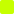

# Конвенции LED-индикации

Физическая раскладка светодиодов по ячейке — [Физическое игровое поле](playfield.md).

## Назначение полос — ячейка существа

Герой использует отдельную раскладку — см. раздел «Ячейка героя» ниже.

| Полоса  | Кол-во | Назначение                                   |
|---------|--------|----------------------------------------------|
| Левая   | 12     | Здоровье (текущее/максимальное)              |
| Правая  | 12     | Атака — **всегда, для всех юнитов**          |
| Верхняя | 8      | Ключевые слова и статусы (по одному LED-флагу на позицию) |
| Нижняя  | 8      | **Зарезервирована** — в текущей версии не несёт функции (назначение будет определено позже) |

## Левая полоса — здоровье и Броня

Левая полоса (`12` LED) показывает здоровье, а **Броня** (Бастион) — янтарными делениями **поверх** здоровья, со стороны максимума. `1` янтарный LED = `1` Броня. Сумма `здоровье + Броня` ≤ `12` (физический предел полосы). Входящий урон сначала гасит янтарные деления (Броню), и только когда они кончились — зелёные (здоровье).

Цвета здоровья (зелёная часть полосы):

- `12–8` LED: **зелёный** — в норме
- `7–4` LED: **жёлтый** — повреждён
- `3–1` LED: **красный** — критическое
- `0` LED: ячейка гаснет

Деления Брони всегда **янтарные** ( `#F39C12`), независимо от уровня здоровья под ними. Пример: здоровье `4`, Броня `2` → LED `1–4` зелёные, LED `5–6` янтарные. После `3` урона → янтарные погасли, зелёных `3` (красная зона).

## Верхняя полоса — ключевые слова и статусы

Каждая позиция — отдельный LED-флаг конкретного ключевого слова или статуса.

| Позиция | Цвет                | Состояние                        |
|---------|---------------------|----------------------------------|
| 1       | Оранжевый           | Провокация                       |
| 2       | Жёлтый мигающий     | Спешка                           |
| 3       | Голубой             | Тип/ПВО (воздушный / Досягаемость — см. ниже) |
| 4       | Фиолетовый мерцающий| Невидим                          |
| 5       | Серый               | Заглушён (также зажигается при **Взломе** Сети — см. ниже) |
| 6       | Циановый мигающий   | Взломан (Сеть) — существо отключено до вашего следующего хода |
| 7       | По типу усиления    | Адаптирован (Химеры) — горит после срабатывания Адаптации (зелёный = здоровье, красный = атака, цвет ключевого слова) |
| 8       | —                   | Резерв под будущие статусы       |

> **Перегрев (Пепел)** и **Свора (Шакалы)** не занимают позиций на верхней полосе — их состояние полностью читается с **правой полосы (атака)**. **Броня (Бастион)** читается с **левой полосы (здоровье)** янтарными делениями (см. ниже). Так все числовые значения видны на поле, а не хранятся в контроллере.

> **Позиция 3 — воздушный бой (3 состояния на одном LED):**
> - **голубой постоянный** — воздушный юнит (уклончивый; сам бьёт любые цели). Опционально лёгкое «парение» — медленная пульсация яркости;
> - **голубой мигающий** — наземный юнит с **Досягаемостью** (может бить воздушные цели);
> - **не горит** — обычный наземный (бьёт только наземные цели).

## Тип юнита и Досягаемость

Вся система воздушного боя кодируется позицией 3 верхней полосы (см. выше) и читается статически с карты. Правила атаки — в `CLAUDE.md`:

- наземные цели (включая героя) атакует кто угодно;
- воздушные цели атакуют только воздушные юниты или юниты с **Досягаемостью**.

При выборе атакующего поле дополнительно подсвечивает допустимые цели (см. «Анимации событий» → «Выбор цели атаки»).

## Нижняя полоса — зарезервирована

Нижняя полоса (8 LED) в текущей версии **не несёт функции** — её назначение будет определено позже. Контроллер не подсвечивает её в покое (кроме кратковременных событийных вспышек по всей рамке — см. «Анимации событий»). Активны три полосы: левая, правая, верхняя.

## Правая полоса — атака, Свора и Перегрев

Правая полоса (`12` LED) всегда показывает **текущую атаку** существа — с учётом всех бонусов. Поэтому механики, меняющие атаку, не требуют отдельного индикатора и **полностью видны игроком**:

- **Свора X** (Шакалы): бонус за дружественные существа уже включён в показанную атаку. Игрок видит точное текущее значение и считает, сколько прибавится за ещё одно своё существо.
- **Перегрев** (Пепел): рост атаки `+1` за ход виден как прибавление LED на правой полосе. Текущая атака = ровно тот урон, что нанесёт **Сброс**. После Сброса полоса возвращается к базовой атаке (напечатана на карте) — это тоже видно.

> Принцип индикации: **все живые числовые значения эффектов читаются с поля** — здоровье и Броня на левой полосе, атака/Свора/Перегрев на правой, статусы и ключевые слова на верхней. Контроллер ничего «скрытого» не накапливает; на карте напечатаны только константы (базовые характеристики, пороги, X), а текущее состояние всегда отражено светодиодами.

## Ячейка героя

Герой использует отдельную раскладку (см. [Физическое поле](playfield.md)): полоса здоровья `30` LED + полоса маны `10` LED.

### Полоса здоровья (30 LED)

`1` LED = `1` единица здоровья (стартовое здоровье героя — `30`).

- `30–20` LED: **зелёный** — в норме
- `19–10` LED: **жёлтый** — повреждён
- `9–1` LED: **красный** — критическое
- `0` LED: герой уничтожен — конец игры

### Полоса маны (10 LED)

`1` LED = `1` единица маны (максимум — `10`).

- Доступная мана: **синий**
- Потраченная в этот ход / ещё недоступная: тёмный
- В начале хода полоса заполняется до текущего максимума, далее гаснет по мере траты

> На ячейке героя активны только полосы здоровья и маны. Индикация силы героя и фракционных пассивок не предусмотрена — это константы/предсказуемые значения, читаемые с карты. **Оружие героя — опциональный, ещё не финализированный модуль** (см. `CLAUDE.md`): если он будет принят, ячейку героя можно **расширить дополнительными светодиодами** под атаку/прочность оружия (аппаратного потолка `40` LED на ячейке героя нет).

## Фракционные цвета

| Фракция  | Основной  | Акцент    |
|----------|-----------|-----------|
| Шакалы   |  `#E8B33A` |  `#C0392B` |
| Пепел    |  `#C6FF00` |  `#FF6600` |
| Химеры   |  `#B026FF` |  `#39FF14` |
| Бастион  |  `#8E8E8E` |  `#F39C12` |
| Сеть     |  `#00E5FF` |  `#7C4DFF` |
| Оазис    |  `#2ECC71` |  `#00CED1` |
| Мираж    |  `#FF00E5` |  `#FFB300` |

## Анимации событий

- **Выставление карты:** однократная вспышка фракционным цветом по всем 40 LED
- **Выбор цели атаки:** при выборе атакующего вражеские ячейки, которые он способен атаковать **по типу** (все наземные + герой; воздушные — только если атакующий воздушный или с **Досягаемостью**), подсвечиваются (рамка пульсирует белым); недопустимые цели остаются тусклыми и невыбираемы
- **Атака:** правая полоса коротко пульсирует красным
- **Получение урона:** левая полоса мигает белым, затем — новое значение
- **Усталость:** полоса здоровья героя коротко мигает фиолетовым перед вычитанием урона усталости, затем показывает новое значение
- **Гибель:** LED гаснут по спирали от центра наружу
- **Свора (Шакалы):** при изменении числа дружественных существ правые полосы всех существ со Сворой одновременно коротко пульсируют песочно-жёлтым ( `#E8B33A`), затем показывают новую атаку
- **Перегрев (Пепел):** в начале хода правая полоса прибавляет `1` LED (рост атаки) — оранжевый отлив на приросте. При **Сбросе** — оранжевая вспышка всех 40 LED, затем правая полоса возвращается к базовой атаке
- **Адаптация (Химеры):** фиолетово-зелёная вспышка верхней полосы; затем загорается позиция 7 цветом выбранного усиления
- **Броня (Бастион):** Броня показана янтарными делениями поверх здоровья на левой полосе. Входящий урон сначала гасит янтарные деления (короткий янтарный всплеск по рамке), зелёные деления здоровья при этом не трогаются; когда Броня исчерпана — урон уходит в здоровье
- **Взлом (Сеть):** вся рамка взломанного юнита перекрашивается в  `#00E5FF` с глитч-эффектом; флаги ключевых слов гаснут, горят серая позиция 5 (Заглушён) и циановая мигающая позиция 6 (Взломан)
- **Цветение (Оазис):** в начале хода по левым полосам всех дружественных существ прокатывается зелёная волна ( `#2ECC71`), затем — новые значения здоровья
- **Эхо (Мираж):** по ячейке-источнику проходит двойная мадженовая вспышка ( `#FF00E5`) при разрешении способности

---

Привязка анимаций к механикам фракций — см. [обзор фракций](../factions/_overview.md) и страницы конкретных фракций.
